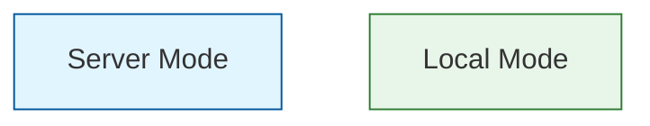

# Architecture Diagrams Guide

This directory contains multiple architecture diagram formats for the Edge-AI Kitchen Assistant project.

## 📁 Available Files

### 1. `README2.md` (Main Documentation)
Contains an **ASCII text architecture diagram** embedded directly in the main README.

**View**: Open `README2.md` and scroll to the "Extended System Architecture" section.

**Pros**:
- ✅ Renders in any text editor
- ✅ Version-controllable (text format)
- ✅ Always in sync with docs
- ✅ Viewable on GitHub without external tools

---

### 2. `ARCHITECTURE_DIAGRAM.md` (Detailed Text Format)
Contains comprehensive **text-based architecture diagrams** with detailed annotations.

**View**: Open in any text editor or Markdown viewer.

**Contents**:
- Complete system architecture (3 modes)
- Detailed data flow diagrams
- Component architecture
- Network communication patterns
- Hardware utilization
- Performance metrics
- Cost analysis

**Best for**:
- Understanding system design
- Documentation
- Technical discussions
- Architecture reviews

---

### 3. `architecture-mermaid.md` (Visual Diagrams)
Contains **Mermaid.js diagram code** that can be rendered as visual flowcharts.

**How to use**:

#### Option A: Online Rendering (Recommended)
1. Open `architecture-mermaid.md`
2. Copy any Mermaid code block (between ` ```mermaid ` and ` ``` `)
3. Go to **[Mermaid Live Editor](https://mermaid.live/)**
4. Paste the code
5. Export as PNG/SVG/PDF

#### Option B: GitHub Rendering
GitHub automatically renders Mermaid diagrams in Markdown files:
1. View `architecture-mermaid.md` on GitHub
2. Diagrams will render automatically

#### Option C: VS Code Extension
1. Install Mermaid extension:
   ```bash
   code --install-extension bierner.markdown-mermaid
   ```
2. Open `architecture-mermaid.md` in VS Code
3. Press `Cmd+Shift+V` (Mac) or `Ctrl+Shift+V` (Windows) for preview

**Available Diagrams**:
1. **Complete System Architecture** - Shows all 3 modes
2. **Detailed Flow Diagram** - Sequence diagram of user interactions
3. **Component Architecture** - Service layer breakdown
4. **Data Flow with Sizes** - Data transformations and sizes
5. **Hardware Utilization** - CPU/GPU/Neural Engine usage
6. **Performance Comparison** - Speed and quality metrics

---

## 🎨 Generating Visual Diagrams

### Quick Start (Mermaid Live Editor)

1. **Go to**: https://mermaid.live/
2. **Copy** any diagram code from `architecture-mermaid.md`
3. **Paste** into the editor
4. **Export**:
   - **PNG**: Best for embedding in presentations
   - **SVG**: Best for high-quality documentation
   - **PDF**: Best for printing

### Example: Generate Complete System Diagram

```bash
# 1. Copy this code from architecture-mermaid.md
# 2. Paste into Mermaid Live Editor
# 3. Export as PNG

graph TB
    subgraph iOS["iOS SwiftUI App"]
        Settings[Settings Toggles]
        Settings -->|OFF/OFF| ServerMode[Server Mode]
        Settings -->|ON/ON| LocalMode[Local Mode]
        Settings -->|ON/OFF| DevMode[Developer Mode]
    end
    
    ServerMode --> AWS[AWS EC2]
    LocalMode --> CoreML[CoreML]
    DevMode --> CoreML2[CoreML]
    
    AWS --> MLX1[MLX]
    CoreML --> MLX2[MLX]
    CoreML2 --> Ollama[Ollama]
```

---

## 📊 Diagram Types Comparison

| Diagram Type | Format | Best For | Tools Needed |
|-------------|--------|----------|--------------|
| **ASCII (README2.md)** | Text | Quick reference, GitHub | Text editor |
| **Text (ARCHITECTURE_DIAGRAM.md)** | Markdown | Detailed docs | Text editor |
| **Mermaid (architecture-mermaid.md)** | Code → Visual | Presentations | Mermaid Live / VS Code |

---

## 🎯 Use Cases

### For Documentation
→ Use **ARCHITECTURE_DIAGRAM.md**
- Comprehensive text descriptions
- Easy to update
- Version controlled

### For Presentations
→ Use **Mermaid diagrams** exported as PNG/SVG
- Professional visuals
- Customizable colors
- High resolution

### For Quick Reference
→ Use **ASCII diagram in README2.md**
- No external tools needed
- Renders everywhere
- Quick overview

### For Technical Reviews
→ Use **Mermaid sequence diagrams**
- Shows data flow clearly
- Interactive (in GitHub)
- Easy to understand

---

## 🔄 Updating Diagrams

### When to Update
Update diagrams when:
- ✅ Adding new processing modes
- ✅ Changing service architecture
- ✅ Modifying data flow
- ✅ Updating performance metrics
- ✅ Adding new components

### Update Process
1. **Edit** `architecture-mermaid.md` (easiest to modify)
2. **Test** in Mermaid Live Editor
3. **Export** new PNG/SVG if needed
4. **Update** `README2.md` ASCII diagram if major changes
5. **Update** `ARCHITECTURE_DIAGRAM.md` text descriptions
6. **Commit** all changes together

---

## 📸 Exporting High-Quality Images

### Recommended Settings (Mermaid Live)

**For GitHub README**:
- Format: PNG
- Width: 1200px
- Background: White
- Theme: Default

**For Documentation**:
- Format: SVG (vector, scales infinitely)
- Theme: Default
- Include: All labels

**For Presentations**:
- Format: PNG
- Width: 1920px (Full HD)
- Background: Transparent or White
- Theme: Dark (if presenting on dark background)

---

## 🛠️ Advanced Usage

### Customizing Mermaid Diagrams

Edit colors in Mermaid code:


### Adding New Diagrams

1. Add Mermaid code to `architecture-mermaid.md`
2. Test in Live Editor
3. Document in this file

---

## 📚 Resources

- **Mermaid Documentation**: https://mermaid.js.org/
- **Mermaid Live Editor**: https://mermaid.live/
- **Mermaid Syntax Guide**: https://mermaid.js.org/intro/syntax-reference.html
- **GitHub Mermaid Support**: https://github.blog/2022-02-14-include-diagrams-markdown-files-mermaid/

---

## 🎓 Learning Path

### Beginner
1. Read `README2.md` ASCII diagram
2. Understand the 3 modes
3. Review data flow

### Intermediate
1. Read `ARCHITECTURE_DIAGRAM.md`
2. Understand detailed components
3. Review performance metrics

### Advanced
1. Open `architecture-mermaid.md`
2. Render diagrams in Mermaid Live
3. Customize and export
4. Create new diagrams for specific use cases

---

## ✅ Quick Checklist

Before presenting or documenting:
- [ ] All 3 modes are clearly shown
- [ ] Data flow is accurate
- [ ] Performance numbers are up-to-date
- [ ] Diagrams are consistent across files
- [ ] New features are reflected in diagrams
- [ ] Visual diagrams are exported (PNG/SVG)

---

## 🤝 Contributing

When updating architecture:
1. Update Mermaid code first (easiest to edit)
2. Generate visual diagrams
3. Update text descriptions
4. Update ASCII diagram last (if needed)
5. Test all renderings
6. Commit with clear message: "docs: update architecture diagrams for [feature]"

---

## 📝 Notes

- **ASCII diagrams** are best for quick edits and version control
- **Mermaid diagrams** are best for presentations and visual clarity
- **Text descriptions** are best for comprehensive documentation
- All formats serve different purposes - maintain all three!

