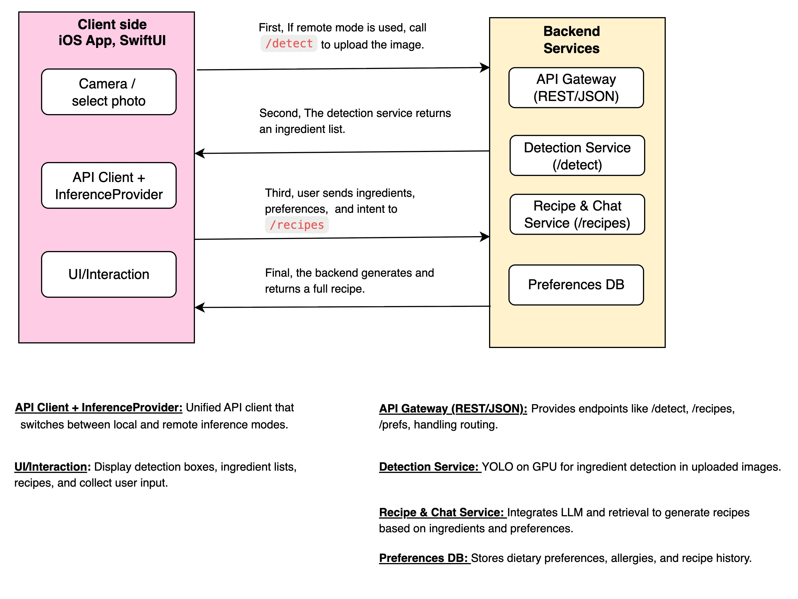
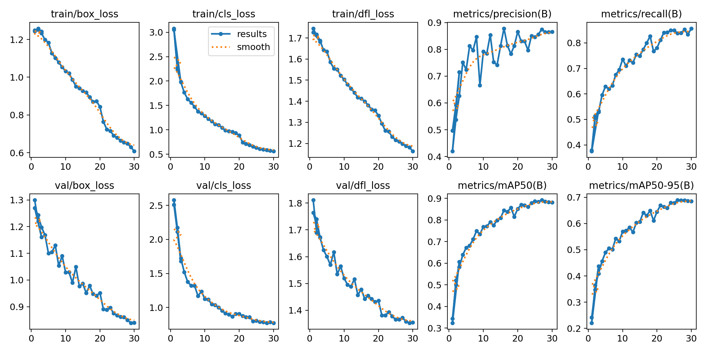
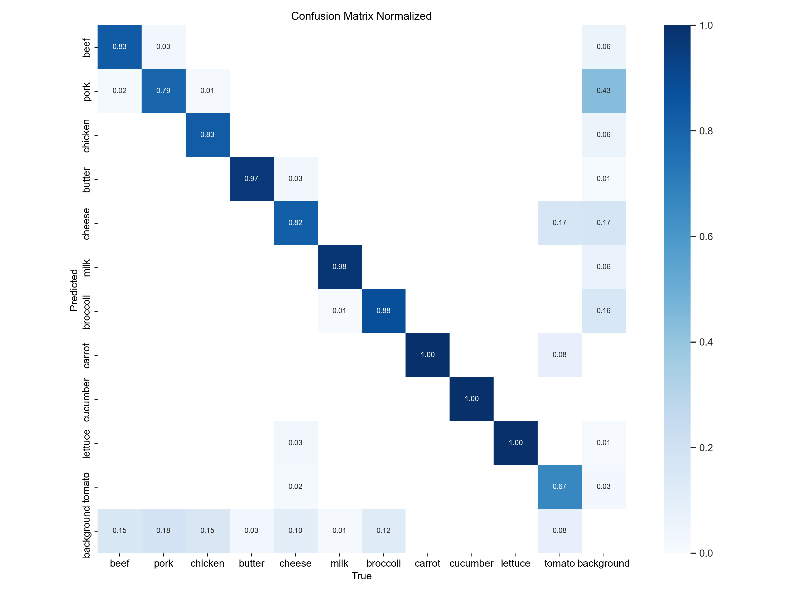

# Edge-AI Kitchen Assistant

1. built a complete frontend-backend separation architecture for a Kitchen Assistant App: an iOS SwiftUI frontend with image upload, ingredient detection, and recipe display features.

2. paired with a Python FastAPI backend including image processing and recipe generation endpoints. 

3. A fully offline macOS companion that takes one photo of your fridge, combines it with whatever meal you're craving, and instantly delivers a step-by-step recipe.

4. using Mock AI services to simulate YOLO ingredient detection and LLM recipe generation


## Current Architecture

### System Overview
```
iOS SwiftUI App ← REST API → FastAPI Backend (localhost:8000)
                               ↓
                            Fine-tuned Yolonv8 for ingredient detection
                            Mock AI Services for recipe generation
```

### Complete Frontend-Backend Architecture Diagram


## Current Implementation Overview

### Complete Frontend-Backend Architecture
- **Native iOS SwiftUI App** with full user interface
- **Python FastAPI Backend** with RESTful API services  
- **End-to-End Data Flow** from camera capture to recipe display


## Finetuning YOLOv8n (CPU)
I fine-tune `yolov8n.pt` on my food dataset using a CPU.

### How to run
```bash
cd backend
source fresh_venv/bin/activate
python3 fine_tune_yolo_cpu_aug.py
```

### Training process
- device: CPU (stable on this machine)
- epochs: 30, batch: 8, imgsz: 640, workers: 2
- optimizer: AdamW (lr0=0.0005, weight_decay=0.0005, warmup_epochs=2)
- augmentations: moderate (hsv_h=0.01, hsv_s=0.3, hsv_v=0.2, fliplr=0.5, mosaic=0.3, mixup=0.0)
- val/plots: enabled; metrics and plots are saved every run
- outputs: `kitchen_assistant_training_cpu_aug/merged_food_yolov8n_cpu_aug_30epochs/`

### Training Results
- Overall metrics and losses over epochs:


- Class-wise performance (normalized confusion matrix):


Short summary:
- Final (epoch 30) precision ≈ 0.865, recall ≈ 0.857
- Final mAP50 ≈ 0.881, mAP50-95 ≈ 0.685
- Train/val losses steadily decreased and plateaued near the end, indicating stable convergence


### Losses (what they mean)
- box_loss: bounding box regression loss. Measures how well predicted boxes overlap with ground truth (IoU-based). Lower is better localization.
- cls_loss: classification loss. Measures how well the model predicts the correct class probabilities (BCE/Logits). Lower is better classification.
- dfl_loss: Distribution Focal Loss. Models box coordinates as discrete distributions for finer localization. Lower is sharper, more precise box edges.

Tips: Typically all three decrease together. As box_loss and dfl_loss drop, mAP50-95 improves; as cls_loss improves, precision/recall increase.


## Dataset
I use `datasets/merged_food_dataset` with 11 classes: 
`beef, pork, chicken, butter, cheese, milk, broccoli, carrot, cucumber, lettuce, tomato`.


## Why not MPS (Apple Silicon GPU)
I attempted MPS training on Python 3.13 with PyTorch ≥2.6 and Ultralytics 8.x, but ran into recurring issues:
- Negative-dimension/validation errors on MPS during training/metrics
- Version constraints on Python 3.13 limit known good torch+ultralytics combos
- `torch.load` security change (`weights_only=True`) required special handling

CPU training is stable and produced strong results (e.g., good mAP50). If I must use MPS, a more compatible stack is Python 3.11 + torch 2.1.0 + ultralytics 8.0.120 with conservative settings (amp=False, small batch/imgsz, minimal augments) and validating on CPU — but this requires a separate environment.


### Data Types Flow
**User Upload**: UIImage → Data (JPEG/PNG)  
*Example: User selects photo from camera roll → 2.3MB JPEG data*

**Backend**: UploadFile → bytes → PIL.Image  
*Example: FastAPI receives multipart file → 2,300,000 bytes → PIL Image object (640×480 RGB)*

**YOLO Input**: PIL.Image  
*Example: PIL Image (640×480×3) ready for model inference*

**YOLO Output**: List[Results] with boxes, confidence, classes  
*Example: 2 detections with boxes=[(90,40,210,160), (300,200,420,320)], conf=[0.91, 0.84], cls=["tomato", "cheese"]*

**Processing**: Map model class names → human-friendly names, keep confidences  
*Example: {ingredients: ["Tomato", "Cheese"], confidence: [0.91, 0.84]}*

**Response**: DetectionResponse (ingredients, confidence, time)  
*Example: {"ingredients": ["Tomato", "Cheese"], "confidence": [0.91, 0.84], "processing_time": 1.2}*

**iOS**: [String] food names, [Double] confidence scores  
*Example: ["Tomato", "Cheese"] and [0.91, 0.84] displayed in UI*

## Quick Start Guide

### 1. Start the Backend Server
```bash
cd backend
source venv/bin/activate  # Activate virtual environment
python main.py            # Start FastAPI server
```
Server will start at `http://localhost:8000`


### 2. Run iOS App
```bash
open ios-app/KitchenAssistant.xcodeproj
```
Select iOS simulator in Xcode and press Play to run

### 3. Test Complete Workflow
1. Open app in iOS simulator
2. Switch to "Scan Fridge" tab
3. Select or capture a photo
4. Enter desired meal type
5. View generated complete recipe


## Next Development Steps

### Local AI Integration
- **On-device food detection (Core ML)**: Convert `best.pt` to Core ML, embed in iOS app, and add local inference path
- **Local/Server toggle**: In Settings, allow switching between Core ML (local) and FastAPI (server) for detection; route `CameraView.processImage()` accordingly
- **Local LLM Service**: Integrate lightweight language model for basic recipe generation