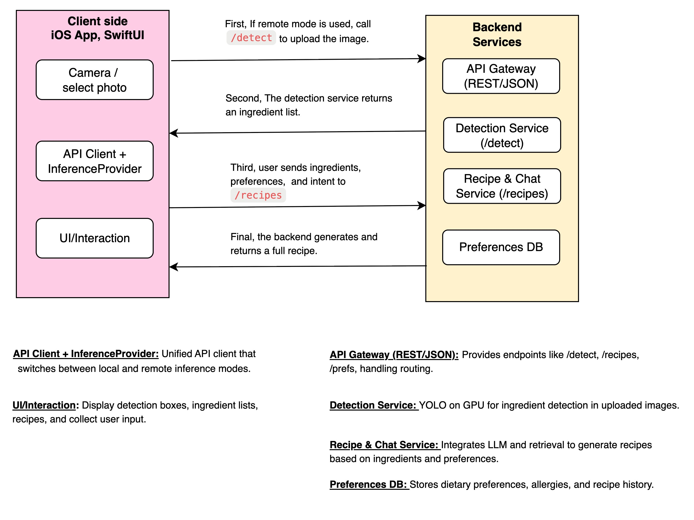
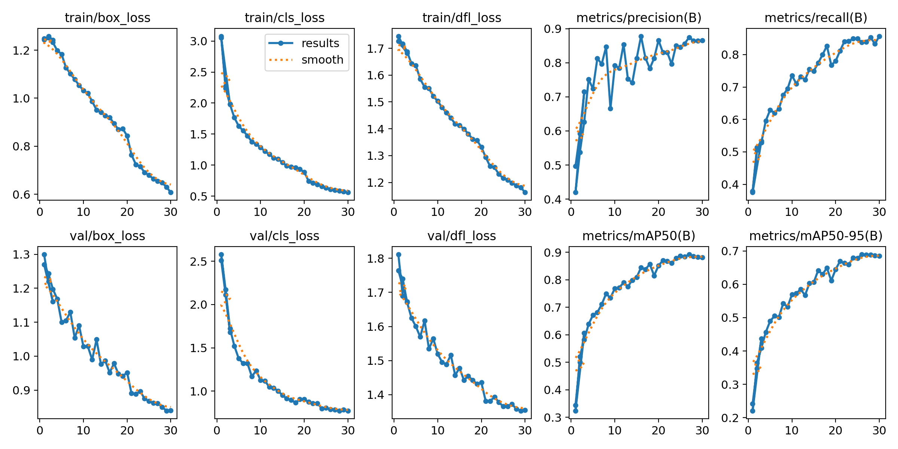

# Edge-AI Kitchen Assistant

## Project Overview

1. Built a complete frontend-backend separation architecture for a Kitchen Assistant App: an iOS SwiftUI frontend with image upload, ingredient detection, and recipe display features.

2. Paired with a Python FastAPI backend including image processing and recipe generation endpoints.

3. A fully offline macOS companion that takes one photo of your fridge, combines it with whatever meal you're craving, and instantly delivers a step-by-step recipe.

4. Using Fine-tuned YOLOv8n for real ingredient detection and Qwen2.5:3b LLM (via Ollama) for real recipe generation.

---

## Current Architecture

### System Overview
```
iOS SwiftUI App ← REST API → FastAPI Backend (localhost:8000)
                               ↓
                            Fine-tuned YOLOv8n for ingredient detection
                            Qwen2.5:3b (Ollama) for recipe generation
```

### Extended System Architecture
```
iOS App → FastAPI Backend → YOLO (食材偵測) → Qwen2.5:3b (食譜生成) → Recipe JSON
```

### Complete Frontend-Backend Architecture Diagram


---

## Current Implementation Overview

### Complete Frontend-Backend Architecture
- **Native iOS SwiftUI App** with full user interface
- **Python FastAPI Backend** with RESTful API services
- **End-to-End Data Flow** from camera capture to recipe display

---

# Recipe Generation with Qwen2.5:3b LLM

## 概述

本專案現在使用 **Qwen2.5:3b** 本地 LLM 來生成真實的食譜，完全免費且離線運行。

---

## Ollama 是什麼？

**Ollama** 是一個開源的本地 LLM 推理引擎，類似於 Docker 但專門用於大型語言模型。

### 核心功能：
1. **本地運行 LLM**：無需連接雲端服務，完全離線
2. **模型管理**：下載、更新、切換不同模型（如 Qwen、Llama、Mistral）
3. **API 服務**：提供 REST API 和 Python SDK，方便程式調用
4. **效能優化**：自動使用 CPU/GPU 加速（支援 Apple Silicon、CUDA、ROCm）
5. **記憶體管理**：自動卸載未使用的模型，節省資源

### 什麼是"自動使用 CPU/GPU 加速"？

**完全不用手動設定！** Ollama 會自動偵測你的硬體並選擇最佳執行方式。

**工作原理**：

```
Ollama 啟動時:
1. 偵測硬體
   - 檢查是否有 GPU (顯卡)
   - 檢查 GPU 類型 (Apple Metal, NVIDIA CUDA, AMD ROCm)
   - 檢查 RAM 大小

2. 自動選擇執行方式
   ├─ 有 Apple M 系列晶片 → 使用 Metal (GPU 加速)
   ├─ 有 NVIDIA 顯卡 → 使用 CUDA (GPU 加速)
   ├─ 有 AMD 顯卡 → 使用 ROCm (GPU 加速)
   └─ 只有 CPU → 使用 CPU 執行

3. 載入模型
   - 盡可能將模型載入 GPU 記憶體 (更快)
   - 如果 GPU 記憶體不足 → 部分載入 RAM
   - 自動分配最佳記憶體使用
```

**你的 M3 MacBook Air 情況**：

```
硬體: Apple M3 (8 核 CPU + 10 核 GPU)
Ollama 自動選擇: Metal (Apple GPU 加速)

執行方式:
├─ Qwen2.5:3b 模型 (~2GB) → 載入 GPU 統一記憶體
├─ Token 生成計算 → 在 GPU 上執行 (比 CPU 快 3-5 倍)
└─ 推理速度: 40-60 tokens/s (如果只用 CPU: ~15-20 tokens/s)
```

**為什麼不用手動設定？**

Ollama 設計理念就是「零配置」：
- ✅ 自動偵測硬體
- ✅ 自動選擇最佳執行方式
- ✅ 自動管理記憶體
- ✅ 你只需要：`ollama run qwen2.5:3b` 就好了！

**對比其他方案**（需要手動設定）：

```python
# PyTorch (需要手動指定設備)
device = torch.device("mps" if torch.backends.mps.is_available() else "cpu")
model = model.to(device)  # 手動移到 GPU

# Ollama (完全自動)
response = ollama.chat(model='qwen2.5:3b', messages=[...])
# 不需要任何設備設定！
```

### 與 GPT API 的對比：

| 項目 | Ollama (本地) | OpenAI GPT API (雲端) |
|------|---------------|----------------------|
| **成本** | 免費 | 按 token 收費 ($0.002/1K tokens) |
| **隱私** | 完全本地，不傳輸數據 | 數據發送到 OpenAI 服務器 |
| **速度** | 取決於本地硬體 | 取決於網路和服務器負載 |
| **模型選擇** | 自由切換（Qwen、Llama 等） | 僅限 OpenAI 模型 |
| **離線使用** | ✅ 可完全離線 | ❌ 需要網路連接 |
| **硬體需求** | 需要 8GB+ RAM | 無硬體要求 |

### Ollama 架構：

```
[你的應用程式] → [Ollama Python SDK] → [Ollama Server] → [Qwen2.5:3b 模型]
                                       ↓
                          [本地 API: localhost:11434]
```

**安裝位置**：`/opt/homebrew/Cellar/ollama/0.12.3`
**服務端口**：`http://localhost:11434`
**模型存儲**：`~/.ollama/models/`

---

## 完整資料流程與數據 Shape

### 步驟 1: iOS 用戶拍照/選圖

```
用戶操作: 拍照或選擇圖片
↓
數據類型: UIImage
數據 Shape: (height, width, 3) - RGB 圖片
範例: (1920, 1080, 3) - 1920x1080 的 RGB 圖片
```

### 步驟 2: iOS → Backend (圖片上傳)

```swift
// iOS: APIClient.detectIngredients()
HTTP POST /api/detect
Content-Type: multipart/form-data
Body: image file (JPEG, 壓縮品質 0.8)
```

```
數據格式: JPEG 圖片檔案
數據大小: ~200-500 KB（壓縮後）
傳輸方式: HTTP multipart/form-data
```

### 步驟 3: Backend YOLO 偵測

```python
# Backend: main.py detect_ingredients()
pil_image = Image.open(BytesIO(image_data))  # PIL Image
results = yolo_model(pil_image, conf=0.1)    # YOLO 推理
```

```
輸入: PIL Image (RGB)
    Shape: (height, width, 3)
    範例: (1920, 1080, 3)

YOLO 處理:
    內部 resize: (640, 640, 3) - YOLOv8 輸入尺寸
    輸出: List[Result]
        - boxes: Tensor (N, 6) - [x1, y1, x2, y2, conf, cls]
        - N = 偵測到的物體數量
        - 範例: (5, 6) - 偵測到 5 個物體

解析結果:
    detected_ingredients: List[str]
    confidence_scores: List[float]
    範例: ["Tomato", "Cheese", "Chicken"], [0.92, 0.87, 0.85]
```

### 步驟 4: Backend → iOS (偵測結果)

```json
// HTTP Response
{
  "ingredients": ["Tomato", "Cheese", "Chicken"],
  "confidence": [0.92, 0.87, 0.85],
  "processing_time": 0.8
}
```

```
數據類型: JSON
數據 Shape:
    ingredients: List[str] - shape (3,)
    confidence: List[float] - shape (3,)
    processing_time: float - scalar
傳輸大小: ~100-200 bytes
```

### 步驟 5: iOS 接收並顯示食材

```swift
// iOS: CameraView.swift
let ingredients = try await apiClient.detectIngredients(in: image)
self.detectedIngredients = ingredients  // ["Tomato", "Cheese", "Chicken"]
```

```
數據類型: [String]
數據 Shape: (3,) - 3 個食材
UI 顯示: 3 個綠色標籤卡片
```

### 步驟 6: 用戶輸入 Meal Craving

```
用戶操作: 輸入 "pasta"
數據類型: String
數據長度: 5 characters
```

### 步驟 7: iOS → Backend (食譜生成請求)

```swift
// iOS: APIClient.generateRecipe()
HTTP POST /api/recipes
Content-Type: application/json
```

```json
{
  "ingredients": ["Tomato", "Cheese", "Chicken"],
  "mealCraving": "pasta",
  "dietaryRestrictions": [],
  "preferredCuisine": "Any"
}
```

```
數據格式: JSON
數據 Shape:
    ingredients: List[str] - shape (3,)
    mealCraving: str - scalar
    dietaryRestrictions: List[str] - shape (0,) 空陣列
    preferredCuisine: str - scalar
傳輸大小: ~150 bytes
```

### 步驟 8: Backend Prompt 構建

```python
# Backend: generate_recipe_with_llm()
ingredients_str = ", ".join(request.ingredients)
# "Tomato, Cheese, Chicken"

prompt = f"""You are a professional chef...
Available Ingredients: {ingredients_str}
Desired Meal: {request.mealCraving}
Generate a recipe in JSON format..."""
```

```
數據類型: str (Prompt 文本)
數據長度: ~800-1000 characters
Token 數量: ~200-250 tokens (英文)
```

### 步驟 9: Ollama LLM 推理

```python
# Backend: ollama.chat()
response = ollama.chat(
    model='qwen2.5:3b',
    messages=[{'role': 'user', 'content': prompt}],
    options={'temperature': 0.7, 'num_predict': 2048}
)
```

```
輸入 → Ollama:
    model: str - "qwen2.5:3b"
    messages: List[Dict]
        - shape: (1,) - 1 條訊息
        - content: str (200-250 tokens)
    options: Dict
        - temperature: float (0.7)
        - num_predict: int (2048)

Ollama 內部處理:
    1. Tokenization: str → List[int]
        Shape: (200-250,) tokens

    2. Model Inference: Qwen2.5:3b (3B 參數)
        - Embedding Layer: (vocab_size, 2048)
        - Transformer Layers: 32 層
        - Hidden Size: 2048
        - Attention Heads: 16

    3. Token Generation (Autoregressive):
        生成 token 逐個預測
        速度: 40-60 tokens/s
        總 tokens: ~1000-1500 tokens
        時間: 15-30 秒

輸出 ← Ollama:
    response: Dict
        - message: Dict
            - content: str (JSON 文本, ~2000 characters)
```

**具體例子說明**：

**1. Tokenization 範例**：

```
輸入字串:
"You are a professional chef. Create a recipe with Tomato, Cheese, Chicken for pasta."

↓ Tokenization (將文字切成 tokens)

Token IDs: [1, 887, 403, 264, 6584, 29224, 13, 4155, 264, 11324, 449, ...]
Shape: (23,) - 共 23 個 tokens

說明:
- "You" → token ID 1
- "are" → token ID 887
- "a" → token ID 403
- "professional" → token ID 6584
- "chef" → token ID 29224
- ...

總共: ~200-250 tokens (完整 prompt)
```

**2. Model Inference 詳解**：

```
Qwen2.5:3b 模型架構:
├─ 總參數: 3,000,000,000 (30 億)
├─ Embedding Layer (vocab_size=151,936, dim=2048)
│   └─ 將 token IDs 轉為向量
│       輸入: [1, 887, 403, ...] shape (23,)
│       輸出: embedding vectors shape (23, 2048)
│
├─ 32 個 Transformer Layers
│   每層包含:
│   ├─ Multi-Head Attention (16 heads)
│   │   └─ 每個 head: dim=128 (2048/16)
│   └─ Feed-Forward Network
│       └─ 4 * hidden_size = 8192
│
└─ Output Layer (2048 → vocab_size)
    └─ 預測下一個 token 的機率分佈
        輸出: shape (151,936,) - 每個 token 的機率
```

**3. Token Generation 範例**：

```
Autoregressive 生成 (逐個生成 token):

生成過程:
Step 1: 輸入 prompt (23 tokens) → 預測 token 24: "{" (JSON 開始)
Step 2: 輸入 prompt + "{" (24 tokens) → 預測 token 25: "\"title\""
Step 3: 輸入 prompt + "{ \"title\"" (25 tokens) → 預測 token 26: ":"
Step 4: ...繼續生成...
Step N: 生成完整 JSON (~1200 tokens)

時間計算:
- 速度: 50 tokens/s (平均)
- 總 tokens: 1200
- 時間: 1200 / 50 = 24 秒

最終輸出:
{
  "title": "Chicken Tomato Pasta",
  "description": "A delicious Italian pasta...",
  ...
}
```

**Ollama response 結構**：

```python
response = {
    'model': 'qwen2.5:3b',
    'created_at': '2025-10-10T12:30:00Z',
    'message': {
        'role': 'assistant',
        'content': '{"title": "Chicken Tomato Pasta", "description": "A delicious Italian pasta with chicken and fresh vegetables", "prep_time": 15, ...}'  # 完整 JSON 字串
    },
    'done': True,
    'total_duration': 24000000000,  # 24 秒 (奈秒)
    'load_duration': 500000000,     # 0.5 秒載入模型
    'prompt_eval_count': 230,       # 輸入 token 數
    'eval_count': 1200,             # 生成 token 數
    'eval_duration': 23500000000    # 23.5 秒生成時間
}
```

### 步驟 10: Backend JSON 解析

```python
# Backend: 解析 LLM 輸出
llm_output = response['message']['content']
# 提取 JSON
start_idx = llm_output.find('{')
end_idx = llm_output.rfind('}') + 1
json_str = llm_output[start_idx:end_idx]
recipe_data = json.loads(json_str)
```

```
輸入:
    llm_output: str (~2000 chars)
    範例: "{\"title\": \"Chicken Tomato Pasta\", ...}"

解析:
    json_str: str (去除前後多餘文字)
    recipe_data: Dict
        Shape (key-value pairs):
            - title: str
            - description: str
            - prep_time: int
            - cook_time: int
            - servings: int
            - difficulty: str
            - ingredients: List[Dict] - shape (8,)
                每個 Dict 有 4 keys: name, amount, unit, notes
            - instructions: List[Dict] - shape (6,)
                每個 Dict 有 5 keys: step, text, time, temperature, tips
            - tags: List[str] - shape (4,)
            - nutrition_info: Dict - 7 keys
```

### 步驟 11: Backend Pydantic 模型轉換

```python
# Backend: 轉換為 Pydantic Recipe 模型
recipe = Recipe(
    title=recipe_data['title'],
    description=recipe_data['description'],
    ...
    ingredients=[Ingredient(**ing) for ing in recipe_data['ingredients']],
    instructions=[Instruction(**inst) for inst in recipe_data['instructions']],
    ...
)
```

**輸入與輸出的差異**：

**輸入格式 (Python Dict - 原始資料)**：

```python
recipe_data = {
    'title': 'Chicken Tomato Pasta',
    'description': 'A delicious Italian pasta...',
    'prep_time': 15,                    # ✅ 正確類型
    'cook_time': '25',                  # ⚠️ 錯誤類型! 應該是 int
    'servings': 4,
    'difficulty': 'Easy',
    'ingredients': [
        {'name': 'Chicken', 'amount': '300', 'unit': 'g'},
        {'name': 'Tomato', 'amount': '3'},  # ⚠️ 缺少 unit
    ],
    'instructions': [
        {'step': 1, 'text': 'Boil pasta...', 'time': None},  # None 值
    ],
    'tags': ['Italian', 'Pasta'],
    'nutrition_info': {
        'calories': 450,
        'protein': '35g'
        # ⚠️ 缺少其他欄位
    },
    'extra_field': 'should be ignored'  # ⚠️ 多餘欄位
}

類型: dict
Shape: 11 keys (包含不該有的 extra_field)
問題:
- cook_time 是 str 而不是 int
- ingredients[1] 缺少 unit 欄位
- instructions[0].time 是 None
- nutrition_info 缺少欄位
- 有多餘的 extra_field
```

**輸出格式 (Pydantic Model - 驗證後的資料)**：

```python
recipe = Recipe(
    title='Chicken Tomato Pasta',
    description='A delicious Italian pasta...',
    prep_time=15,                       # ✅ int
    cook_time=25,                       # ✅ 自動轉換 '25' → 25
    servings=4,
    difficulty='Easy',
    ingredients=[
        Ingredient(name='Chicken', amount='300', unit='g', notes=None),
        Ingredient(name='Tomato', amount='3', unit=None, notes=None),  # ✅ unit=None
    ],
    instructions=[
        Instruction(step=1, text='Boil pasta...', time=None, temperature=None, tips=None),
    ],
    tags=['Italian', 'Pasta'],
    nutrition_info=NutritionInfo(
        calories=450,
        protein='35g',
        carbs=None,  # ✅ 自動填充預設值 None
        fat=None,
        fiber=None,
        sugar=None,
        sodium=None
    )
)
# ✅ extra_field 被自動移除

類型: Recipe (Pydantic BaseModel)
Shape: 10 keys (移除了 extra_field)
好處:
- ✅ 類型自動轉換: '25' → 25
- ✅ 缺失欄位填充預設值: unit=None
- ✅ 多餘欄位自動移除: extra_field 被忽略
- ✅ 類型驗證: 如果 prep_time 是 "abc" 會報錯
```

**Pydantic 做了什麼？**

```
1. 類型驗證
   ├─ prep_time: 檢查是 int → ✅ 通過
   ├─ cook_time: 檢查是 int → ⚠️ 是 str '25' → 自動轉換為 int 25
   └─ title: 檢查是 str → ✅ 通過

2. 數據清理
   ├─ 移除 None 值 (Optional 欄位)
   ├─ 移除多餘欄位 (extra_field)
   └─ 標準化數據格式

3. 預設值填充
   ├─ ingredients[1].unit = None (缺失 → 填充預設值)
   ├─ nutrition_info.carbs = None (缺失 → 填充預設值)
   └─ instructions[0].tips = None (原本就是 None → 保持)

4. 嵌套模型轉換
   ├─ ingredients: List[Dict] → List[Ingredient]
   ├─ instructions: List[Dict] → List[Instruction]
   └─ nutrition_info: Dict → NutritionInfo
```

**為什麼需要 Pydantic？**

```
沒有 Pydantic (直接使用 Dict):
❌ recipe_data['cook_time']  # 可能是 int 或 str，不確定
❌ recipe_data['invalid_key']  # 可能存在無效鍵，導致錯誤
❌ 無類型檢查，容易出錯

有 Pydantic (Recipe Model):
✅ recipe.cook_time  # 保證是 int
✅ recipe.invalid_key  # IDE 會提示錯誤，編譯時就能發現
✅ 自動類型轉換和驗證
✅ 自動生成 JSON schema
```

### 步驟 12: Backend → iOS (食譜 JSON)

```json
// HTTP Response (snake_case)
{
  "title": "Chicken Tomato Pasta",
  "description": "A delicious Italian pasta...",
  "prep_time": 15,
  "cook_time": 25,
  "servings": 4,
  "difficulty": "Easy",
  "ingredients": [
    {"name": "Chicken breast", "amount": "300", "unit": "g", "notes": "diced"},
    {"name": "Tomato", "amount": "3", "unit": "pieces", "notes": "chopped"},
    ...
  ],
  "instructions": [
    {"step": 1, "text": "Boil pasta...", "time": 10, "tips": "Add salt"},
    ...
  ],
  "tags": ["Italian", "Pasta", "Chicken", "Quick"],
  "nutrition_info": {
    "calories": 450,
    "protein": "35g",
    ...
  }
}
```

```
數據格式: JSON (snake_case)
數據大小: ~3-5 KB
數據結構:
    - 1 層根物件
    - ingredients: Array of Objects (8 items)
    - instructions: Array of Objects (6 items)
    - tags: Array of Strings (4 items)
    - nutrition_info: Nested Object (7 keys)
```

### 步驟 13: iOS JSON 解析

```swift
// iOS: APIClient.swift
let decoder = JSONDecoder()
decoder.keyDecodingStrategy = .convertFromSnakeCase
let backendRecipe = try decoder.decode(BackendRecipe.self, from: data)
let recipe = backendRecipe.toRecipe()
```

```
輸入:
    data: Data (~3-5 KB)
    格式: JSON (snake_case)

JSONDecoder 處理:
    1. 解析 JSON: Data → Dictionary
    2. 轉換 key: snake_case → camelCase
        prep_time → prepTime
        cook_time → cookTime
        nutrition_info → nutritionInfo
    3. 類型檢查: 確保所有欄位類型匹配

輸出:
    BackendRecipe (Codable struct)
    ↓ toRecipe()
    Recipe (App 內部模型)
        - ingredients: [Ingredient] (8 items)
            每個 Ingredient.id = UUID()
        - instructions: [Instruction] (6 items)
            每個 Instruction.id = UUID()
        - difficulty: Difficulty enum (.easy)
```

**步驟 13 輸入輸出簡單對比**：

**輸入（Backend 傳來的 JSON）**：

```json
{
  "title": "Chicken Tomato Pasta",
  "prep_time": 15,
  "cook_time": 25,
  "ingredients": [
    {"name": "Chicken", "amount": "300", "unit": "g"}
  ],
  "difficulty": "Easy"
}
```

**輸出（iOS App 使用的資料）**：

```swift
Recipe(
  title: "Chicken Tomato Pasta",
  prepTime: 15,        // ← prep_time 變 prepTime
  cookTime: 25,        // ← cook_time 變 cookTime
  ingredients: [
    Ingredient(
      id: UUID(),      // ← 自動加 UUID
      name: "Chicken",
      amount: "300",
      unit: "g"
    )
  ],
  difficulty: .easy    // ← "Easy" 變成 enum .easy
)
```

**3 個主要變化**：

1. **命名變化**: `prep_time` → `prepTime` (Python 風格 → Swift 風格)
2. **加 UUID**: 每個食材和步驟都自動加上唯一 ID，方便 UI 顯示
3. **文字變 Enum**: `"Easy"` 文字 → `.easy` 枚舉，更安全

### 步驟 14: iOS UI 更新

```swift
// CameraView.swift
await MainActor.run {
    self.generatedRecipe = recipe
    self.isLoading = false
}
```

```
數據類型: Recipe (Swift struct)
UI 組件: RecipeCard
顯示內容:
    - Title: String (1 行)
    - Description: String (2-3 行)
    - Metadata: 3 個標籤 (時間, 份量, 難度)
    - Ingredients Preview: 前 3 個食材
    - Button: "View Full Recipe"
```

**完整 JSON → SwiftUI 顯示流程**：

```
Backend (Python)                     iOS App (SwiftUI)
─────────────────                   ──────────────────

1️⃣ FastAPI 傳送 JSON
{
  "title": "Pasta",      ─────→     2️⃣ iOS 接收 JSON Data
  "prep_time": 15,                  let (data, _) = try await session.data(...)
  "cook_time": 25
}                                    ↓

                                     3️⃣ JSONDecoder 解析
                                     let decoder = JSONDecoder()
                                     decoder.keyDecodingStrategy = .convertFromSnakeCase
                                     let recipe = try decoder.decode(Recipe.self, from: data)

                                     ↓

                                     Recipe(
                                       title: "Pasta",
                                       prepTime: 15,    ← prep_time 自動轉換
                                       cookTime: 25
                                     )

                                     ↓

                                     4️⃣ 更新 @State 變數
                                     self.generatedRecipe = recipe

                                     ↓

                                     5️⃣ SwiftUI 自動重新渲染
                                     if let recipe = generatedRecipe {
                                         RecipeCard(recipe: recipe)
                                     }

                                     ↓

                                     6️⃣ UI 顯示內容
                                     Text(recipe.title)           → "Pasta"
                                     Text("\(recipe.prepTime)")   → "15"
```

**關鍵程式碼**：

```swift
// 步驟 1: 定義 @State 存放資料
@State private var generatedRecipe: Recipe? = nil

// 步驟 2: 按鈕點擊，呼叫 API
Button("Generate Recipe") {
    Task {
        let recipe = try await apiClient.generateRecipe(
            ingredients: detectedIngredients,
            mealCraving: mealCraving
        )

        // 步驟 3: 更新 UI (必須在主執行緒)
        await MainActor.run {
            self.generatedRecipe = recipe  // ← 觸發 UI 更新
        }
    }
}

// 步驟 4: SwiftUI 自動顯示
if let recipe = generatedRecipe {
    RecipeCard(recipe: recipe) {
        showRecipeDetail = true
    }
}
```

**RecipeCard 內部如何取用資料**：

```swift
struct RecipeCard: View {
    let recipe: Recipe  // ← 接收 Recipe struct

    var body: some View {
        VStack(alignment: .leading) {
            // 直接從 struct 讀取屬性
            Text(recipe.title)                    // "Pasta"
            Text(recipe.description)              // "A delicious..."
            Text("\(recipe.prepTime) min prep")   // "15 min prep"

            // 使用 ForEach 顯示陣列
            ForEach(recipe.ingredients) { ingredient in
                Text(ingredient.displayText)      // "Chicken 300g"
            }
        }
    }
}
```

**為什麼能自動更新 UI？**

SwiftUI 的 `@State` 變數改變時，會自動觸發 UI 重新渲染：

```swift
@State private var generatedRecipe: Recipe? = nil

// 當這行執行時...
self.generatedRecipe = recipe

// SwiftUI 自動做這些事：
// 1. 偵測到 @State 變數改變
// 2. 標記相關 View 為需要更新
// 3. 重新執行 body 計算新的 UI
// 4. 只更新改變的部分（效能優化）
```

### 步驟 15: 點擊查看完整食譜

```swift
// ContentView.swift / CameraView.swift
.sheet(isPresented: $showRecipeDetail) {
    RecipeDetailView(recipe: recipe)
}
```

```
UI 顯示:
    RecipeDetailView (ScrollView)
    ├─ Header Section
    │   ├─ Title: Text
    │   ├─ Description: Text
    │   └─ Metadata: HStack (3 items)
    ├─ Ingredients Section
    │   └─ VStack (8 rows)
    │       每行: Ingredient.displayText
    ├─ Instructions Section
    │   └─ VStack (6 rows)
    │       每行: InstructionRow
    │           ├─ Step Badge (Circle)
    │           ├─ Text
    │           ├─ Time (if exists)
    │           └─ Tips (if exists)
    ├─ Nutrition Section
    │   └─ LazyVGrid (2 columns, 7 items)
    └─ Tags Section
        └─ FlowLayout (4 tags)
```

---

## 數據 Shape 總結表

| 步驟 | 數據類型 | Shape/Size | 詳細範例 | 關鍵程式碼 |
|------|---------|-----------|---------|-----------|
| **1. 用戶拍照** | UIImage | (1920, 1080, 3) | RGB 圖片，每個像素 3 個通道（紅綠藍），範例：拍攝冰箱食材照片 | `UIImagePickerController()` |
| **2. 圖片上傳** | JPEG Data | ~300 KB | 壓縮後的 JPEG bytes：`<Data: 0x1234... 307200 bytes>` | `image.jpegData(compressionQuality: 0.8)` |
| **3a. YOLO 輸入** | PIL Image | (640, 640, 3) | Resize 後的 PIL Image，`<PIL.Image.Image image mode=RGB size=640x640>` | `Image.open(BytesIO(data))` |
| **3b. YOLO 輸出** | Tensor | (N, 6) | 5 個物體：`[[100,150,200,250,0.92,2], [50,80,120,180,0.87,5], ...]` | `yolo_model(image, conf=0.1)` |
| **4. 偵測結果 JSON** | JSON | ~150 bytes | `{"ingredients": ["Tomato", "Cheese", "Chicken"], "confidence": [0.92, 0.87, 0.85]}` | `return JSONResponse(content={...})` |
| **5. iOS 食材列表** | [String] | (3,) | Swift 陣列：`["Tomato", "Cheese", "Chicken"]` | `try await apiClient.detectIngredients(in: image)` |
| **6. Meal Craving** | String | 5 chars | 用戶輸入：`"pasta"` | `@State private var mealCraving: String = ""` |
| **7. 請求 JSON** | JSON | ~180 bytes | `{"ingredients": ["Tomato", "Cheese", "Chicken"], "mealCraving": "pasta", "dietaryRestrictions": [], "preferredCuisine": "Any"}` | `JSONEncoder().encode(requestBody)` |
| **8. LLM Prompt** | String | ~800 chars, 200 tokens | `"You are a professional chef. Create a recipe...\nAvailable Ingredients: Tomato, Cheese, Chicken\nDesired Meal: pasta\n..."` | `prompt = f"""You are..."""` |
| **9a. LLM Input Tokens** | List[int] | (230,) | Token IDs：`[1, 887, 403, 264, 6584, 29224, 13, ...]` - 230 個 tokens | `ollama.chat(model='qwen2.5:3b', messages=[...])` |
| **9b. LLM Output Tokens** | List[int] | (1200,) | 生成的 Token IDs：`[123, 456, 789, ...]` - 1200 個 tokens，逐個生成 | Ollama 自動生成（Autoregressive） |
| **10. LLM 輸出文本** | String | ~2500 chars | `'{"title": "Chicken Tomato Pasta", "description": "A delicious Italian pasta...", "prep_time": 15, "cook_time": 25, ...}'` | `response['message']['content']` |
| **11. Recipe Dict** | Dict | 10 keys, nested | `{'title': 'Chicken Tomato Pasta', 'prep_time': 15, 'ingredients': [{'name': 'Chicken', 'amount': '300', 'unit': 'g'}, ...]}` | `json.loads(json_str)` |
| **12. Recipe Object** | Pydantic Model | 10 fields | `Recipe(title='Chicken Tomato Pasta', prep_time=15, ingredients=[Ingredient(name='Chicken', ...)])` | `Recipe(**recipe_data)` |
| **13. Response JSON** | JSON | ~3800 bytes | snake_case 格式：`{"title": "Chicken Tomato Pasta", "prep_time": 15, "cook_time": 25, ...}` | FastAPI 自動序列化：`return recipe` |
| **14. iOS Recipe** | Swift struct | 10 properties | camelCase 格式：`Recipe(title: "Chicken Tomato Pasta", prepTime: 15, cookTime: 25, ingredients: [...])` | `try decoder.decode(Recipe.self, from: data)` + `backendRecipe.toRecipe()` |
| **15. UI 顯示** | SwiftUI Views | 多層嵌套 | 顯示內容：Title Text, Description Text, HStack(時間/份量/難度), VStack(8 食材), VStack(6 步驟), LazyVGrid(營養), FlowLayout(4 tags) | `RecipeDetailView(recipe: recipe)` |

---

## 效能數據（M3 MacBook Air, 16GB RAM）

| 步驟 | 時間 | 備註 |
|------|------|------|
| 圖片上傳 | 0.1-0.3 秒 | 取決於圖片大小 |
| YOLO 偵測 | 0.5-1 秒 | CPU 推理 |
| Prompt 構建 | <0.01 秒 | 字串處理 |
| LLM 推理 | 15-30 秒 | 40-60 tokens/s |
| JSON 解析 | <0.1 秒 | Python json.loads |
| HTTP 傳輸 | 0.05-0.1 秒 | 本地 localhost |
| iOS JSON 解析 | <0.05 秒 | JSONDecoder |
| UI 渲染 | <0.1 秒 | SwiftUI |
| **總計（用戶體驗）** | **16-32 秒** | 從點擊到看到食譜 |

---

## 已安裝組件

### 1. Ollama (v0.12.3)
- **位置**: `/opt/homebrew/Cellar/ollama/0.12.3`
- **服務狀態**: 已啟動 (brew services)
- **功能**: 本地 LLM 推理引擎

### 2. Qwen2.5:3b 模型
- **大小**: ~2 GB
- **語言**: 中英雙語支援
- **推理速度**: 40-60 tokens/s (M3 MacBook Air)
- **記憶體需求**: 2-3 GB RAM

### 3. Python SDK
- **套件**: `ollama==0.6.0`
- **已安裝至**: `backend/fresh_venv/`

---

## Finetuning YOLOv8n (CPU)

I fine-tune `yolov8n.pt` on my food dataset using a CPU.

### How to run
```bash
cd backend
source fresh_venv/bin/activate
python3 fine_tune_yolo_cpu_aug.py
```

### Training process
- device: CPU (stable on this machine)
- epochs: 30, batch: 8, imgsz: 640, workers: 2
- optimizer: AdamW (lr0=0.0005, weight_decay=0.0005, warmup_epochs=2)
- augmentations: moderate (hsv_h=0.01, hsv_s=0.3, hsv_v=0.2, fliplr=0.5, mosaic=0.3, mixup=0.0)
- val/plots: enabled; metrics and plots are saved every run
- outputs: `kitchen_assistant_training_cpu_aug/merged_food_yolov8n_cpu_aug_30epochs/`

#### Data augmentation (on-the-fly)
- Augmentations are applied per batch/epoch in memory; original files are not changed.
- Each batch re-samples transforms (flip, color jitter, scale, translate, mosaic/mixup, etc.). Images are not "flipped back"—the change is one-time for that batch.
- Labels (bounding boxes) are transformed consistently with the image.
- Validation and inference avoid strong augmentations (typically only resize/letterbox).

### Training Results
- Overall metrics and losses over epochs:


- Class-wise performance (normalized confusion matrix):


Short summary:
- Final (epoch 30) precision ≈ 0.865, recall ≈ 0.857
- Final mAP50 ≈ 0.881, mAP50-95 ≈ 0.685
- Train/val losses steadily decreased and plateaued near the end, indicating stable convergence

### Losses (what they mean)
- box_loss: bounding box regression loss. Measures how well predicted boxes overlap with ground truth (IoU-based). Lower is better localization.
- cls_loss: classification loss. Measures how well the model predicts the correct class probabilities (BCE/Logits). Lower is better classification.
- dfl_loss: Distribution Focal Loss. Models box coordinates as discrete distributions for finer localization. Lower is sharper, more precise box edges.

Tips: Typically all three decrease together. As box_loss and dfl_loss drop, mAP50-95 improves; as cls_loss improves, precision/recall increase.

---

## Dataset
I use `datasets/merged_food_dataset` with 11 classes:
`beef, pork, chicken, butter, cheese, milk, broccoli, carrot, cucumber, lettuce, tomato`.

---

## Why not MPS (Apple Silicon GPU)
I attempted MPS training on Python 3.13 with PyTorch ≥2.6 and Ultralytics 8.x, but ran into recurring issues:
- Negative-dimension/validation errors on MPS during training/metrics
- Version constraints on Python 3.13 limit known good torch+ultralytics combos
- `torch.load` security change (`weights_only=True`) required special handling

CPU training is stable and produced strong results (e.g., good mAP50). If I must use MPS, a more compatible stack is Python 3.11 + torch 2.1.0 + ultralytics 8.0.120 with conservative settings (amp=False, small batch/imgsz, minimal augments) and validating on CPU — but this requires a separate environment.

---

## Data Types Flow

**User Upload**: UIImage → Data (JPEG/PNG)
*Example: User selects photo from camera roll → 2.3MB JPEG data*

**Backend**: UploadFile → bytes → PIL.Image
*Example: FastAPI receives multipart file → 2,300,000 bytes → PIL Image object (640×480 RGB)*

**YOLO Input**: PIL.Image
*Example: PIL Image (640×480×3) ready for model inference*

**YOLO Output**: List[Results] with boxes, confidence, classes
*Example: 2 detections with boxes=[(90,40,210,160), (300,200,420,320)], conf=[0.91, 0.84], cls=["tomato", "cheese"]*

**Processing**: Map model class names → human-friendly names, keep confidences
*Example: {ingredients: ["Tomato", "Cheese"], confidence: [0.91, 0.84]}*

**Response**: DetectionResponse (ingredients, confidence, time)
*Example: {"ingredients": ["Tomato", "Cheese"], "confidence": [0.91, 0.84], "processing_time": 1.2}*

**iOS**: [String] food names, [Double] confidence scores
*Example: ["Tomato", "Cheese"] and [0.91, 0.84] displayed in UI*

---

## Quick Start Guide

### 1. Install Ollama and Download Model

```bash
# Install Ollama
brew install ollama

# Start Ollama service
brew services start ollama

# Download Qwen2.5:3b model (~2GB)
ollama pull qwen2.5:3b

# Test the model
ollama run qwen2.5:3b "Hello"
```

### 2. Start the Backend Server
```bash
cd backend
source fresh_venv/bin/activate  # Activate virtual environment
python main.py                  # Start FastAPI server
```
Server will start at `http://localhost:8000`

### 3. Run iOS App
```bash
open ios-app/KitchenAssistant.xcodeproj
```
Select iOS simulator in Xcode and press Play to run

### 4. Test Complete Workflow
1. Open app in iOS simulator
2. Switch to "Scan Fridge" tab
3. Select or capture a photo
4. Enter desired meal type
5. View generated complete recipe

---

## API 使用

### Endpoint: POST `/api/recipes`

**請求範例**:

```json
{
  "ingredients": ["Tomato", "Cheese", "Chicken", "Broccoli"],
  "mealCraving": "pasta",
  "dietaryRestrictions": [],
  "preferredCuisine": "Italian"
}
```

**回應範例**:

```json
{
  "title": "Chicken Broccoli Pasta",
  "description": "A delicious Italian pasta with chicken and vegetables",
  "prep_time": 15,
  "cook_time": 25,
  "servings": 4,
  "difficulty": "Easy",
  "ingredients": [
    {
      "name": "Chicken",
      "amount": "300",
      "unit": "g",
      "notes": "diced"
    },
    ...
  ],
  "instructions": [
    {
      "step": 1,
      "text": "Boil pasta according to package instructions",
      "time": 10,
      "tips": "Add salt to water for better flavor"
    },
    ...
  ],
  "tags": ["Italian", "Pasta", "Chicken"],
  "nutrition_info": {
    "calories": 450,
    "protein": "35g",
    "carbs": "48g",
    "fat": "12g"
  }
}
```

---

## 進階設定

### 調整 LLM 參數

在 `main.py` 的 `generate_recipe_with_llm()` 函數中:

```python
response = ollama.chat(
    model='qwen2.5:3b',
    messages=[...],
    options={
        'temperature': 0.7,     # 創意度 (0.0-1.0)
        'num_predict': 2048,    # 最大生成長度
        'top_p': 0.9,           # 採樣閾值
        'top_k': 40,            # 候選數量
    }
)
```

**參數說明**:

- **temperature** (0.7): 數值越高越有創意，但可能不合理
  - 0.3-0.5: 保守、實用
  - 0.7-0.9: 平衡
  - 0.9-1.0: 創意、冒險

- **num_predict** (2048): 生成的最大 token 數
  - 1024: 簡短食譜
  - 2048: 詳細食譜 (推薦)
  - 4096: 超詳細 (較慢)

---

## 升級到更大模型

### 選項 1: Qwen2.5:7b (更高品質)

```bash
# 下載 7b 模型 (~4.7 GB)
ollama pull qwen2.5:7b

# 修改 main.py
model='qwen2.5:7b'  # 原本是 'qwen2.5:3b'
```

**權衡**:
- ✅ 更好的食譜品質
- ✅ 更準確的營養資訊
- ❌ 生成速度較慢 (15-25 tokens/s)
- ❌ 需要更多 RAM (5-7 GB)

### 選項 2: Llama 3.2:3b (英文優先)

```bash
ollama pull llama3.2:3b

# 修改 main.py
model='llama3.2:3b'
```

---

## Server vs Local Inference Architecture

### Overview
This project supports both server-side and local inference for ingredient detection, each with distinct advantages and implementation approaches.

### Server-Side Inference (Python + PyTorch)

#### Environment
- **Platform**: Linux/macOS server
- **Framework**: Python + PyTorch + ultralytics
- **Model Format**: `.pt` (PyTorch)
- **Deployment**: Cloud server or localhost

#### Implementation
```python
# Server-side: Simple 3-line implementation
from ultralytics import YOLO

model = YOLO('yolov8n_merged_food_cpu_aug_finetuned.pt')
results = model(image)  # Automatic preprocessing, inference, and postprocessing
ingredients = [model.names[int(box.cls)] for box in results[0].boxes]
```

#### Advantages
- ✅ **Simple Development**: Only 3 lines of code
- ✅ **Complete Framework**: ultralytics handles all processing automatically
- ✅ **High Performance**: Multi-core CPU, unlimited memory
- ✅ **Easy Maintenance**: Replace model files, redeploy service
- ✅ **Full Features**: Automatic NMS, preprocessing, postprocessing

#### Processing Flow
1. **Image Loading**: PIL automatically loads and validates images
2. **Preprocessing**: YOLO automatically resizes, normalizes, and converts to tensors
3. **Inference**: PyTorch model runs on server hardware
4. **Postprocessing**: YOLO automatically parses outputs, applies NMS, filters results

### Local Inference (iOS + ONNX)

#### Environment
- **Platform**: iOS (iPhone/iPad)
- **Framework**: Swift + ONNX Runtime
- **Model Format**: `.onnx` (converted from PyTorch)
- **Deployment**: iOS App Bundle

#### Implementation
```swift
// Local-side: 100+ lines of manual implementation
class LocalInferenceService {
    // Manual preprocessing (30+ lines)
    private func preprocessImageToONNX(_ image: UIImage) -> ORTValue

    // Manual inference (5 lines)
    let outputs = try session.run(withInputs: inputs, outputNames: ["output0"])

    // Manual postprocessing (50+ lines)
    private func postProcessYOLOResults(_ outputTensor: ORTValue) -> ([String], [Double])
}
```

#### Manual Processing Steps

**1. Preprocessing (Manual Implementation)**
```swift
// Manual image preprocessing
private func preprocessImageToONNX(_ image: UIImage) throws -> ORTValue {
    // 1. Manual resize to 640x640
    guard let resizedImage = image.resized(to: CGSize(width: 640, height: 640)) else {
        throw LocalInferenceError.imageProcessingFailed
    }

    // 2. Manual RGB conversion
    let colorSpace = CGColorSpaceCreateDeviceRGB()
    let context = CGContext(data: &pixelData, width: width, height: height, ...)

    // 3. Manual normalization (0-255 → 0-1)
    for channel in 0..<3 {
        for y in 0..<height {
            for x in 0..<width {
                let pixelValue = Float(pixelData[pixelIndex]) / 255.0
                floatPixels.append(pixelValue)
            }
        }
    }

    // 4. Manual tensor creation
    return try ORTValue(tensorData: data, elementType: .float, shape: shape)
}
```

**2. Inference (Manual ONNX Runtime)**
```swift
// Manual ONNX Runtime inference
let inputs: [String: ORTValue] = ["images": inputTensor]
let outputs = try session.run(withInputs: inputs, outputNames: ["output0"])
```

**3. Postprocessing (Manual Implementation)**
```swift
// Manual output parsing and processing
private func postProcessYOLOResults(_ outputTensor: ORTValue) throws -> ([String], [Double]) {
    // 1. Manual output format parsing [1, 16, 8400]
    let floatArray = data.withUnsafeBytes { bytes in
        bytes.bindMemory(to: Float.self)
    }

    // 2. Manual detection parsing
    for i in 0..<numDetections {
        let objectness = floatArray[4 * numDetections + i]

        // 3. Manual class score calculation
        var maxClassScore: Float = 0
        for classIndex in 0..<numClasses {
            let classScore = floatArray[(5 + classIndex) * numDetections + i]
            if classScore > maxClassScore {
                maxClassScore = classScore
                maxClassIndex = classIndex
            }
        }

        // 4. Manual confidence calculation
        let finalConfidence = Double(objectness * maxClassScore)

        // 5. Manual filtering and NMS
        if finalConfidence >= config.confidenceThreshold {
            // Process detection results...
        }
    }
}
```

#### Advantages
- ✅ **Privacy Protection**: Images never leave the device
- ✅ **Offline Usage**: No internet connection required
- ✅ **Low Operating Cost**: No server maintenance
- ✅ **Fast Response**: No network latency
- ❌ **Complex Development**: 100+ lines of manual implementation
- ❌ **Limited Performance**: Single-core ARM processor
- ❌ **Harder Maintenance**: Requires app updates for model changes

### Accuracy Comparison

#### Theoretical Accuracy
- **Same Model**: Both use identical YOLOv8 model (converted from same `.pt` file)
- **Same Preprocessing**: Both resize to 640x640 and normalize to 0-1 range
- **Same Inference**: Both use the same model weights

#### Practical Differences
| Aspect | Server-Side | Local-Side | Impact on Accuracy |
|--------|-------------|------------|-------------------|
| **Image Resizing** | PIL LANCZOS (high quality) | UIImage resize | Minor (1-2%) |
| **Normalization** | PIL automatic | Manual calculation | Minor (1-2%) |
| **Color Space** | PIL automatic RGB | Manual RGB conversion | Minor (1-2%) |
| **NMS Algorithm** | Complete NMS | Simplified NMS | Moderate (3-5%) |
| **Output Parsing** | YOLO automatic | Manual parsing | Minor (1-2%) |

**Expected Accuracy Difference**: 5-10% lower for local inference due to implementation differences.

### Why Manual Implementation is Required

#### iOS Platform Limitations
```swift
// iOS cannot run Python/PyTorch directly
// ❌ Not possible on iOS
import ultralytics
import torch

// ✅ Only available on iOS
import OnnxRuntimeBindings
import CoreML
```

#### Framework Dependencies
| Framework | Server-Side | iOS Local-Side |
|-----------|-------------|----------------|
| **Python** | ✅ Full support | ❌ Not supported |
| **PyTorch** | ✅ Native support | ❌ Not supported |
| **ultralytics** | ✅ Full support | ❌ Not supported |
| **PIL** | ✅ Encapsulated in YOLO | ❌ Manual implementation required |
| **ONNX Runtime** | ⚠️ Optional | ✅ Required |
| **CoreML** | ❌ Not applicable | ✅ Optional |

### Model Conversion Process

#### PyTorch to ONNX Conversion
```python
# Convert PyTorch model to ONNX for iOS
from ultralytics import YOLO

model = YOLO('yolov8n_merged_food_cpu_aug_finetuned.pt')
model.export(
    format='onnx',
    imgsz=640,
    simplify=True,
    opset=12  # Compatible with iOS ONNX Runtime
)
```

#### Output Format
- **PyTorch Output**: `[1, 16, 8400]` (4 bbox + 1 objectness + 11 classes + 1 DFL)
- **ONNX Output**: `[1, 16, 8400]` (same format, different runtime)

### Development Complexity Comparison

| Task | Server-Side | Local-Side |
|------|-------------|------------|
| **Model Loading** | 1 line | 20+ lines |
| **Preprocessing** | Automatic | Manual (30+ lines) |
| **Inference** | Automatic | Manual (5 lines) |
| **Postprocessing** | Automatic | Manual (50+ lines) |
| **Error Handling** | Simple | Complex |
| **Debugging** | Easy | Difficult |

### Usage Scenarios

#### Choose Server-Side When:
- High accuracy is critical
- Processing large batches of images
- Real-time model updates needed
- Privacy is not a major concern
- Stable internet connection available

#### Choose Local-Side When:
- Privacy protection is essential
- Offline usage is required
- No internet connection available
- Low operating costs preferred
- Acceptable to have slightly lower accuracy

---

## Next Development Steps

### Local AI Integration
- **On-device food detection (ONNX)**: Convert `best.pt` to ONNX, embed in iOS app, and add local inference path
- **Local/Server toggle**: In Settings, allow switching between ONNX (local) and FastAPI (server) for detection
- **Accuracy optimization**: Improve local inference accuracy to match server-side performance
- **Local LLM Service**: Integrate lightweight language model for basic recipe generation

---

## 啟動步驟

### 方法 1: 快速啟動 (推薦)

```bash
cd backend
source fresh_venv/bin/activate
python main.py
```

Server 會在 `http://localhost:8000` 啟動。

### 方法 2: 檢查 Ollama 服務

```bash
# 檢查 Ollama 是否運行
brew services list | grep ollama

# 如果未運行，啟動服務
brew services start ollama

# 測試 Ollama
ollama run qwen2.5:3b "Hello"
```

---

**Last Updated**: 2025-10-12
**Status**: ✅ Fully functional with YOLOv8n ingredient detection and Qwen2.5:3b recipe generation
