# Architecture Diagram (Mermaid Format)

## Complete System Architecture with Three Modes

Copy this code to [Mermaid Live Editor](https://mermaid.live/) to generate the diagram:

```mermaid
graph TB
    subgraph iOS["iOS SwiftUI App (iPhone 12+, iOS 16+)"]
        UI[User Interface]
        Settings[Settings Toggles<br/>- Use Local Processing<br/>- Use MLX Generation]
        
        UI --> Settings
        
        Settings -->|OFF/OFF| ServerMode[Server Mode]
        Settings -->|ON/ON| LocalMode[Local Mode]
        Settings -->|ON/OFF| DevMode[Developer Mode]
    end
    
    subgraph Detection["Detection Layer"]
        AWS[AWS EC2 FastAPI<br/>YOLOv8n PyTorch<br/>☁️ ~500ms-1s]
        CoreML1[CoreML YOLO<br/>Neural Engine<br/>📱 ~100ms]
        CoreML2[CoreML YOLO<br/>Neural Engine<br/>📱 ~100ms]
    end
    
    subgraph Recipe["Recipe Generation Layer"]
        MLX1[MLX LLM<br/>Qwen2.5-0.5B<br/>📱 10-30s<br/>Good Quality]
        MLX2[MLX LLM<br/>Qwen2.5-0.5B<br/>📱 10-30s<br/>Good Quality]
        Ollama[Ollama LLM<br/>Qwen2.5:3b<br/>🖥️ 5-10s<br/>Excellent Quality]
    end
    
    subgraph Result["Recipe Display"]
        Recipe1[Recipe Detail View<br/>Title, Ingredients, Steps]
        Recipe2[Recipe Detail View<br/>Title, Ingredients, Steps]
        Recipe3[Recipe Detail View<br/>Title, Ingredients, Steps]
    end
    
    ServerMode -->|HTTP API| AWS
    LocalMode --> CoreML1
    DevMode --> CoreML2
    
    AWS -->|JSON Response| MLX1
    CoreML1 --> MLX2
    CoreML2 -->|HTTP to Mac| Ollama
    
    MLX1 --> Recipe1
    MLX2 --> Recipe2
    Ollama --> Recipe3
    
    style ServerMode fill:#e1f5ff,stroke:#01579b
    style LocalMode fill:#e8f5e9,stroke:#2e7d32
    style DevMode fill:#fff3e0,stroke:#e65100
    
    style AWS fill:#ffcdd2,stroke:#c62828
    style CoreML1 fill:#c8e6c9,stroke:#388e3c
    style CoreML2 fill:#c8e6c9,stroke:#388e3c
    
    style MLX1 fill:#b3e5fc,stroke:#0277bd
    style MLX2 fill:#b3e5fc,stroke:#0277bd
    style Ollama fill:#ffe0b2,stroke:#f57c00
```



---

## Detailed Flow Diagram


---

## Component Architecture


---

## Data Flow with Sizes

```mermaid
graph TD
    Photo[User Photo<br/>UIImage<br/>~2MB JPEG]
    
    Photo --> Decision{Mode?}
    
    Decision -->|Server| Upload[Upload to AWS<br/>~300KB compressed]
    Decision -->|Local/Dev| CoreML[CoreML Input<br/>640x640 RGB]
    
    Upload --> YOLO1[YOLOv8n PyTorch<br/>Output: Tensor<br/>5 objects detected]
    CoreML --> YOLO2[YOLOv8n CoreML<br/>Output: MLMultiArray<br/>5 objects detected]
    
    YOLO1 --> Ingredients1[Ingredients JSON<br/>~150 bytes<br/>Array of Strings]
    YOLO2 --> Ingredients2[Ingredients Array<br/>Swift [String]<br/>5 items]
    
    Ingredients1 --> RecipeInput1[Recipe Request<br/>~180 bytes JSON]
    Ingredients2 --> RecipeInput2[Recipe Request<br/>Swift struct]
    
    RecipeInput1 --> MLX1[MLX Inference<br/>Prompt: ~200 tokens<br/>Output: ~1200 tokens]
    RecipeInput2 --> Decision2{MLX or Ollama?}
    
    Decision2 -->|MLX ON| MLX2[MLX Inference<br/>Qwen2.5-0.5B<br/>10-30s]
    Decision2 -->|MLX OFF| Ollama1[Ollama Inference<br/>Qwen2.5:3b<br/>5-10s]
    
    MLX1 --> RecipeJSON1[Recipe JSON<br/>~3-5KB<br/>snake_case]
    MLX2 --> RecipeJSON2[Recipe JSON<br/>~3-5KB<br/>snake_case]
    Ollama1 --> RecipeJSON3[Recipe JSON<br/>~3-5KB<br/>snake_case]
    
    RecipeJSON1 --> Parse1[JSONDecoder<br/>Convert to Swift]
    RecipeJSON2 --> Parse2[Direct Swift struct]
    RecipeJSON3 --> Parse3[JSONDecoder<br/>Convert to Swift]
    
    Parse1 --> Display1[SwiftUI Display]
    Parse2 --> Display2[SwiftUI Display]
    Parse3 --> Display3[SwiftUI Display]
    
    style Photo fill:#e1f5fe
    style Upload fill:#ffcdd2
    style CoreML fill:#c8e6c9
    style MLX1 fill:#b3e5fc
    style MLX2 fill:#b3e5fc
    style Ollama1 fill:#ffe0b2
```

---

## Hardware Utilization


---

## Performance Comparison


---

## Instructions to Generate Diagrams

1. **Copy any of the Mermaid code blocks above**
2. **Go to**: https://mermaid.live/
3. **Paste the code** into the editor
4. **Export options**:
   - PNG (recommended for README)
   - SVG (recommended for high-quality)
   - PDF (for documentation)

Or use VS Code with Mermaid extension:
```bash
# Install Mermaid extension
code --install-extension bierner.markdown-mermaid
```

Or render in GitHub README (GitHub supports Mermaid natively):
````markdown

````

