# Architecture Diagram (Mermaid Format)

## Complete System Architecture with Three Modes

Copy this code to [Mermaid Live Editor](https://mermaid.live/) to generate the diagram:

```mermaid
graph TB
    subgraph iOS["iOS KITCHEN ASSISTANT APP (iPhone 12+, iOS 16+)"]
        Workflow["USER WORKFLOW:<br/>Photo → Detect → Input → Recipe"]
        Settings["SETTINGS:<br/>Use Local Processing<br/>Use MLX Generation"]
        
        Workflow --> Settings
        
        Settings --> Mode1[MODE 1<br/>Server Mode]
        Settings --> Mode2[MODE 2<br/>Local Mode]
        Settings --> Mode3[MODE 3<br/>Developer Mode]
    end
    
    subgraph Stage1["STAGE 1: INGREDIENT DETECTION"]
        ServerDetect["☁️ Server Mode<br/>━━━━━━━━━━━━━━━<br/>AWS EC2 Server<br/>FastAPI Backend<br/><br/>Model: YOLOv8n PyTorch<br/>Size: N/A<br/>Need: WiFi<br/>Speed: 0.5-1s<br/>Privacy: Med"]
        
        LocalDetect["📱 Local Mode<br/>━━━━━━━━━━━━━━━<br/>CoreML<br/>Neural Engine<br/><br/>Model: yolov8n.mlmodel<br/>Size: ~6MB<br/>Need: None<br/>Speed: ~100ms<br/>Privacy: High"]
        
        DevDetect["📱 Developer Mode<br/>━━━━━━━━━━━━━━━<br/>CoreML<br/>Neural Engine<br/><br/>Model: yolov8n.mlmodel<br/>Size: ~6MB<br/>Need: None<br/>Speed: ~100ms<br/>Privacy: High"]
    end
    
    subgraph Stage2["STAGE 2: RECIPE GENERATION"]
        ServerRecipe["📱 Server Mode<br/>━━━━━━━━━━━━━━━<br/>iPhone MLX<br/>Model: Qwen2.5-0.5B<br/>4-bit quantized<br/><br/>Size: ~300MB<br/>Params: 500M<br/>Hardware: iPhone GPU<br/>Need: None<br/>Speed: 10-30s<br/>Quality: Good<br/>Privacy: High"]
        
        LocalRecipe["📱 Local Mode<br/>━━━━━━━━━━━━━━━<br/>iPhone MLX<br/>Model: Qwen2.5-0.5B<br/>4-bit quantized<br/><br/>Size: ~300MB<br/>Params: 500M<br/>Hardware: iPhone GPU<br/>Need: None<br/>Speed: 10-30s<br/>Quality: Good<br/>Privacy: High"]
        
        DevRecipe["🖥️ Developer Mode<br/>━━━━━━━━━━━━━━━<br/>Mac Ollama<br/>Model: Qwen2.5:3b<br/>Full model<br/><br/>Size: ~2GB<br/>Params: 3B<br/>Hardware: Mac GPU (M3)<br/>Need: WiFi<br/>Speed: 5-10s<br/>Quality: Excellent<br/>Privacy: High"]
    end
    
    subgraph Stage3["STAGE 3: DISPLAY TO USER"]
        Display["Recipe Detail View<br/>━━━━━━━━━━━━━━━<br/>Chicken Tomato Pasta<br/>25 min | 4 servings<br/><br/>INGREDIENTS (8)<br/>STEPS (6)<br/>NUTRITION"]
    end
    
    Mode1 --> ServerDetect
    Mode2 --> LocalDetect
    Mode3 --> DevDetect
    
    ServerDetect -->|Detected<br/>Ingredients| ServerRecipe
    LocalDetect -->|Detected<br/>Ingredients| LocalRecipe
    DevDetect -->|Detected<br/>Ingredients| DevRecipe
    
    ServerRecipe -->|Recipe JSON| Display
    LocalRecipe -->|Recipe JSON| Display
    DevRecipe -->|Recipe JSON| Display
    
    style Mode1 fill:#e1f5ff,stroke:#01579b,stroke-width:2px
    style Mode2 fill:#e8f5e9,stroke:#2e7d32,stroke-width:2px
    style Mode3 fill:#fff3e0,stroke:#e65100,stroke-width:2px
    
    style ServerDetect fill:#ffcdd2,stroke:#c62828,stroke-width:2px
    style LocalDetect fill:#c8e6c9,stroke:#388e3c,stroke-width:2px
    style DevDetect fill:#c8e6c9,stroke:#388e3c,stroke-width:2px
    
    style ServerRecipe fill:#b3e5fc,stroke:#0277bd,stroke-width:2px
    style LocalRecipe fill:#b3e5fc,stroke:#0277bd,stroke-width:2px
    style DevRecipe fill:#ffe0b2,stroke:#f57c00,stroke-width:2px
    
    style Display fill:#f3e5f5,stroke:#7b1fa2,stroke-width:3px
```



---

## Detailed Flow Diagram


---

## Component Architecture


---

## Data Flow with Sizes (Horizontal Layout)


---

## Hardware Utilization


---

## Performance Comparison


---

## CI/CD Integration

### Backend CI/CD Pipeline


### iOS CI/CD Pipeline

```mermaid
graph LR
    A[GitHub Push] --> B[GitHub Actions]
    B --> C[xcodebuild<br/>Build App]
    C --> D{Build Success?}
    D -->|Yes| E[XCTest<br/>Unit Tests]
    D -->|No| F[❌ Build Failed]
    E --> G{Tests Pass?}
    G -->|Yes| H[XCUITest<br/>UI Tests]
    G -->|No| I[❌ Tests Failed]
    H --> J{UI Tests Pass?}
    J -->|Yes| K[Archive Build]
    J -->|No| L[❌ UI Tests Failed]
    K --> M{Deploy?}
    M -->|Yes| N[Upload to<br/>TestFlight]
    M -->|No| O[✅ CI Complete]
    N --> P[✅ Deployment<br/>Complete]
    
    style A fill:#e8f5e9
    style B fill:#c8e6c9
    style C fill:#a5d6a7
    style E fill:#81c784
    style H fill:#66bb6a
    style K fill:#4caf50
    style N fill:#43a047
    style O fill:#c8e6c9
    style P fill:#c8e6c9
    style F fill:#ffcdd2
    style I fill:#ffcdd2
    style L fill:#ffcdd2
```



### CI/CD Workflow Comparison


---

## Complete Data Flow Through the System

The application processes data through multiple stages, transforming a simple photo into a complete recipe. Here's how data shapes and formats evolve at each step:

### Data Flow Diagram

```mermaid
graph TB
    Start[User Takes Photo] --> Capture[UIImage Capture<br/>1920×1080×3 RGB<br/>~2-3 MB]
    
    Capture --> ModeCheck{Processing<br/>Mode?}
    
    subgraph Stage1["STAGE 1: DETECTION"]
        ModeCheck -->|Server| Upload[Upload Image<br/>POST /api/detect<br/>JPEG 200-400 KB<br/>100-500ms]
        ModeCheck -->|Local/Dev| LocalPrep[Local Preprocess<br/>Resize to 640×640]
        
        Upload --> ServerYOLO[Server YOLO<br/>PyTorch CPU<br/>300-500ms]
        LocalPrep --> LocalYOLO[CoreML YOLO<br/>Neural Engine<br/>~100ms]
        
        ServerYOLO --> DetectionTensor1[Tensor Output<br/>N×6 array<br/>bbox + conf + class]
        LocalYOLO --> DetectionTensor2[MLMultiArray<br/>N×6 array<br/>bbox + conf + class]
    end
    
    DetectionTensor1 --> Mapping1[Class Mapping<br/>ID → Name]
    DetectionTensor2 --> Mapping2[Class Mapping<br/>ID → Name]
    
    Mapping1 --> IngredientsJSON[Ingredients JSON<br/>150-300 bytes<br/>Tomato, Cheese, Chicken]
    Mapping2 --> IngredientsJSON
    
    IngredientsJSON --> UserInput[User Input<br/>Meal Craving: pasta<br/>Dietary: None<br/>Cuisine: Italian]
    
    UserInput --> RequestPayload[Request Payload<br/>JSON 200-400 bytes<br/>ingredients + preferences]
    
    subgraph Stage2["STAGE 2: RECIPE GENERATION"]
        RequestPayload --> Prompt[Prompt Construction<br/>400-600 characters<br/>System + User prompt]
        
        Prompt --> ModeCheck2{LLM<br/>Mode?}
        
        ModeCheck2 -->|Server/Local| MLXToken[MLX Tokenization<br/>230 tokens<br/>Qwen2.5 tokenizer]
        ModeCheck2 -->|Developer| OllamaToken[Ollama Tokenization<br/>230 tokens<br/>Qwen2.5 tokenizer]
        
        MLXToken --> MLXInfer[MLX Inference<br/>Qwen2.5-0.5B-4bit<br/>24 layers, 896 hidden<br/>20-30 tok/s<br/>10-30 seconds]
        OllamaToken --> OllamaInfer[Ollama Inference<br/>Qwen2.5:3b<br/>32 layers, 2048 hidden<br/>40-60 tok/s<br/>5-10 seconds]
        
        MLXInfer --> GenTokens1[Generated Tokens<br/>~1200 tokens<br/>JSON text]
        OllamaInfer --> GenTokens2[Generated Tokens<br/>~1200 tokens<br/>JSON text]
    end
    
    GenTokens1 --> Extract[Extract JSON<br/>Regex parsing<br/>Remove markdown]
    GenTokens2 --> Extract
    
    Extract --> RecipeJSON[Recipe JSON<br/>3-5 KB<br/>title, ingredients, steps, nutrition]
    
    subgraph Stage3["STAGE 3: UI RENDERING"]
        RecipeJSON --> Decode[JSONDecoder<br/>snake_case → camelCase<br/>Generate UUIDs<br/>~10ms]
        
        Decode --> SwiftStruct[Swift Recipe Struct<br/>Codable object<br/>In-memory]
        
        SwiftStruct --> Binding[Data Binding<br/>@Published property<br/>Trigger update]
        
        Binding --> UIRender[SwiftUI Render<br/>RecipeDetailView<br/>~16ms, 60 FPS]
    end
    
    UIRender --> Display[Display Recipe<br/>Title, Image, Ingredients<br/>Steps, Nutrition]
    
    style Start fill:#e1f5fe
    style Capture fill:#b3e5fc
    style Upload fill:#ffcdd2
    style LocalPrep fill:#c8e6c9
    style ServerYOLO fill:#ffcdd2
    style LocalYOLO fill:#c8e6c9
    style IngredientsJSON fill:#fff9c4
    style UserInput fill:#f3e5f5
    style Prompt fill:#e1bee7
    style MLXInfer fill:#b3e5fc
    style OllamaInfer fill:#ffe0b2
    style RecipeJSON fill:#c5e1a5
    style Decode fill:#bbdefb
    style SwiftStruct fill:#90caf9
    style UIRender fill:#64b5f6
    style Display fill:#4caf50,color:#fff
    
    style Stage1 fill:#fff3e0,stroke:#ff6f00,stroke-width:2px
    style Stage2 fill:#e8f5e9,stroke:#2e7d32,stroke-width:2px
    style Stage3 fill:#e3f2fd,stroke:#1565c0,stroke-width:2px
```



---

### Simplified Data Flow (Horizontal)

```mermaid
graph LR
    Photo[Photo<br/>2-3 MB] --> Detection[YOLO Detection<br/>640×640 input<br/>100ms-1s]
    
    Detection --> Ingredients[Ingredients<br/>JSON Array<br/>150-300 B]
    
    Ingredients --> Input[User Input<br/>+Craving<br/>+Preferences]
    
    Input --> LLM[LLM Generation<br/>Qwen2.5<br/>5-30s]
    
    LLM --> Recipe[Recipe JSON<br/>3-5 KB]
    
    Recipe --> Parse[Parse & Bind<br/>Swift Struct]
    
    Parse --> UI[UI Display<br/>SwiftUI]
    
    style Photo fill:#e1f5fe
    style Detection fill:#fff3e0
    style Ingredients fill:#fff9c4
    style Input fill:#f3e5f5
    style LLM fill:#e8f5e9
    style Recipe fill:#c5e1a5
    style Parse fill:#bbdefb
    style UI fill:#4caf50,color:#fff
```



---

### Data Flow Sequence Diagram


---

### Data Size Evolution

```mermaid
graph TB
    subgraph Input["INPUT STAGE"]
        S1[Photo: 2-3 MB<br/>Uncompressed]
        S2[Upload: 200-400 KB<br/>JPEG compressed]
        S3[Model Input: ~1.2 MB<br/>640×640×3 tensor]
    end
    
    subgraph Processing["PROCESSING"]
        S4[Detection Output: 50-200 B<br/>N×6 tensor]
        S5[Ingredients JSON: 150-300 B<br/>Array of strings]
        S6[LLM Prompt: 1-2 KB<br/>~230 tokens]
    end
    
    subgraph Output["OUTPUT STAGE"]
        S7[LLM Output: 10-15 KB<br/>~1200 tokens raw text]
        S8[Recipe JSON: 3-5 KB<br/>Cleaned & parsed]
        S9[Swift Struct: In-Memory<br/>Native objects]
    end
    
    S1 --> S2 --> S3
    S3 --> S4 --> S5 --> S6
    S6 --> S7 --> S8 --> S9
    
    style Input fill:#e3f2fd
    style Processing fill:#fff3e0
    style Output fill:#e8f5e9
    
    style S1 fill:#ef5350,color:#fff
    style S2 fill:#ff7043
    style S3 fill:#ffa726
    style S4 fill:#ffee58
    style S5 fill:#d4e157
    style S6 fill:#9ccc65
    style S7 fill:#66bb6a
    style S8 fill:#26a69a
    style S9 fill:#26c6da
```



---

### Processing Time Breakdown


---

### Detailed Step-by-Step Breakdown

### Step 1: User Takes Photo
**iOS Camera Capture**
- **Format**: `UIImage` (native iOS image object)
- **Dimensions**: `(1920, 1080, 3)` - RGB image data
- **Size**: ~2-3 MB uncompressed in memory
- **Color Space**: sRGB, 8 bits per channel

---

### Step 2: Image Upload to Backend (Server Mode Only)
**HTTP POST Request**
- **Endpoint**: `POST /api/detect`
- **Content-Type**: `multipart/form-data`
- **Image Format**: JPEG with 0.8 compression quality
- **Compressed Size**: ~200-400 KB
- **Network Time**: 100-500ms (depending on connection)

---

### Step 3: YOLO Detection Processing
**Image Preprocessing**
- **Input Resize**: `(1920, 1080, 3)` → `(640, 640, 3)`
- **Normalization**: Pixel values scaled to `[0, 1]`
- **Batch Dimension**: `(1, 640, 640, 3)` for model input

**YOLO Model Inference**
- **Model**: YOLOv8n (nano variant)
- **Architecture**: 
  - 225 layers total
  - ~3.2M parameters
  - 8.7 GFLOPs computation
- **Processing Time**: 
  - Server (CPU): 300-500ms
  - Local (Neural Engine): ~100ms

**Detection Output Tensor**
- **Shape**: `(N, 6)` where N = number of detected objects
- **Format**: `[x_min, y_min, x_max, y_max, confidence, class_id]`
- **Example**:
```python
[
    [100, 150, 200, 250, 0.92, 2],  # Tomato at (100,150)-(200,250), 92% confidence, class 2
    [50, 80, 120, 180, 0.87, 5],    # Cheese at (50,80)-(120,180), 87% confidence, class 5
    [300, 200, 450, 400, 0.85, 1]   # Chicken at (300,200)-(450,400), 85% confidence, class 1
]
```

**Class ID Mapping**
```python
FOOD_MAPPING = {
    0: "Beef", 1: "Chicken", 2: "Tomato", 3: "Carrot",
    4: "Onion", 5: "Cheese", 6: "Milk", 7: "Butter",
    8: "Pork", 9: "Potato", 10: "Cabbage", 11: "Broccoli"
}
```

---

### Step 4: Detection Results Returned
**JSON Response Structure**
```json
{
    "ingredients": ["Tomato", "Cheese", "Chicken"],
    "confidence": [0.92, 0.87, 0.85],
    "count": 3,
    "processing_time": 0.342,
    "model_version": "yolov8n_merged_food_cpu_aug_finetuned"
}
```
- **Size**: ~150-300 bytes
- **Encoding**: UTF-8
- **Response Time**: 
  - Server Mode: 500ms-1s (network + inference)
  - Local Mode: ~100ms (inference only)

---

### Step 5: User Inputs Meal Craving
**User Input**
- **Type**: String input via SwiftUI TextField
- **Example**: `"pasta"`, `"soup"`, `"stir-fry"`
- **Optional Fields**:
  - Dietary restrictions: `["vegetarian", "gluten-free"]`
  - Preferred cuisine: `"Italian"`, `"Chinese"`, `"Any"`
  - Servings: `2`, `4`, `6`

---

### Step 6: Recipe Generation Request
**HTTP POST to LLM Service**

**Server/Local Mode (MLX on iPhone)**:
- **Endpoint**: Internal MLX inference (no HTTP)
- **Input Format**: Direct Swift struct

**Developer Mode (Ollama on Mac)**:
- **Endpoint**: `POST http://192.168.1.100:11434/api/generate`
- **Content-Type**: `application/json`

**Request Payload**:
```json
{
    "ingredients": ["Tomato", "Cheese", "Chicken"],
    "mealCraving": "pasta",
    "dietaryRestrictions": [],
    "preferredCuisine": "Italian",
    "servings": 4
}
```
- **Size**: ~200-400 bytes

---

### Step 7: Prompt Construction
**System Prompt Template**
```text
You are a professional chef AI assistant. Create a detailed recipe in JSON format.

Available Ingredients: Tomato, Cheese, Chicken
Desired Meal Type: pasta
Dietary Restrictions: None
Preferred Cuisine: Italian
Servings: 4

Generate a recipe with the following JSON structure:
{
  "title": "Recipe Name",
  "description": "Brief description",
  "prepTime": 15,
  "cookTime": 25,
  "servings": 4,
  "ingredients": [{"name": "Chicken", "amount": "300", "unit": "g"}, ...],
  "instructions": [{"step": 1, "text": "Instruction text", "time": 5}, ...],
  "nutritionInfo": {"calories": 450, "protein": "35g", ...},
  "tags": ["Italian", "Pasta", "Quick"]
}
```
- **Prompt Length**: ~400-600 characters (~200-250 tokens)

---

### Step 8: LLM Tokenization & Inference

**Tokenization Process**
- **Input**: Prompt string (~500 characters)
- **Tokenizer**: Qwen2.5 tokenizer (vocabulary size: 151,936)
- **Output**: Token ID sequence
```python
Token IDs: [1, 887, 403, 264, 6584, 29224, 13, 6204, 263, ...]  # ~230 tokens
```

**Model Architecture**
- **Qwen2.5-0.5B (MLX)**:
  - 24 transformer layers
  - 896 hidden dimensions
  - 14 attention heads
  - 494M parameters (4-bit quantized → ~300MB)
  
- **Qwen2.5:3b (Ollama)**:
  - 32 transformer layers
  - 2048 hidden dimensions
  - 16 attention heads
  - 3B parameters (FP16 → ~2GB)

**Inference Process**
1. **Embedding Layer**: Token IDs → Dense vectors `(230, 896)` or `(230, 2048)`
2. **Transformer Layers**: Self-attention + FFN repeated 24 or 32 times
3. **Autoregressive Generation**: Generate tokens one-by-one
   - Each token generation: ~30-50ms (MLX) or ~15-20ms (Ollama)
   - Total tokens generated: ~1000-1500 tokens
4. **Stopping Criteria**: End token `</s>` or max length (2048 tokens)

**Generation Statistics**
- **MLX (iPhone)**:
  - Speed: 20-30 tokens/second
  - Total Time: 10-30 seconds
  - Memory Usage: ~800MB peak
  
- **Ollama (Mac M3)**:
  - Speed: 40-60 tokens/second
  - Total Time: 5-10 seconds
  - Memory Usage: ~3GB peak

**Generated Token Sequence Example**
```python
Generated Token IDs: [123, 456, 789, 234, 567, ...]  # ~1200 tokens
# Decoded text: '{"title": "Chicken Tomato Pasta", "description": ...'
```

---

### Step 9: Recipe JSON Response
**LLM Output Parsing**
- **Raw Output**: String containing JSON (may have markdown formatting)
- **Extraction**: Regex to extract JSON from markdown code blocks
```python
# Raw LLM output:
"""
Here's a delicious recipe for you:

```json
{
  "title": "Chicken Tomato Pasta",
  "description": "A delicious Italian pasta dish...",
  "prepTime": 15,
  "cookTime": 25,
  ...
}
```
"""
```

**Cleaned JSON Structure**
```json
{
  "title": "Chicken Tomato Pasta",
  "description": "A delicious Italian pasta dish with tender chicken and fresh tomatoes",
  "prepTime": 15,
  "cookTime": 25,
  "servings": 4,
  "ingredients": [
    {"name": "Chicken breast", "amount": "300", "unit": "g"},
    {"name": "Tomato", "amount": "2", "unit": "medium"},
    {"name": "Cheese", "amount": "100", "unit": "g"},
    {"name": "Pasta", "amount": "400", "unit": "g"},
    {"name": "Olive oil", "amount": "2", "unit": "tbsp"},
    {"name": "Garlic", "amount": "3", "unit": "cloves"},
    {"name": "Salt", "amount": "1", "unit": "tsp"},
    {"name": "Black pepper", "amount": "0.5", "unit": "tsp"}
  ],
  "instructions": [
    {"step": 1, "text": "Boil water in a large pot and cook pasta according to package instructions", "time": 10},
    {"step": 2, "text": "Cut chicken into bite-sized pieces and season with salt and pepper", "time": 3},
    {"step": 3, "text": "Heat olive oil in a pan and sauté minced garlic until fragrant", "time": 2},
    {"step": 4, "text": "Add chicken pieces and cook until golden brown on all sides", "time": 8},
    {"step": 5, "text": "Add diced tomatoes and simmer for 5 minutes", "time": 5},
    {"step": 6, "text": "Drain pasta and mix with chicken-tomato sauce. Top with grated cheese", "time": 2}
  ],
  "nutritionInfo": {
    "calories": 520,
    "protein": "38g",
    "carbs": "62g",
    "fat": "12g",
    "fiber": "4g"
  },
  "tags": ["Italian", "Pasta", "Quick", "High-Protein"]
}
```
- **JSON Size**: ~3-5 KB
- **Encoding**: UTF-8

---

### Step 10: iOS JSON Parsing & Data Transformation
**JSONDecoder Processing**
```swift
// Swift Codable struct
struct Recipe: Codable, Identifiable {
    let id: UUID = UUID()  // Auto-generated unique ID
    let title: String
    let description: String
    let prepTime: Int
    let cookTime: Int
    let servings: Int
    let ingredients: [Ingredient]
    let instructions: [Instruction]
    let nutritionInfo: NutritionInfo
    let tags: [String]
    
    // Custom coding keys for snake_case to camelCase conversion
    enum CodingKeys: String, CodingKey {
        case title, description, servings, ingredients, instructions, tags
        case prepTime = "prep_time"
        case cookTime = "cook_time"
        case nutritionInfo = "nutrition_info"
    }
}
```

**Why Generate Unique IDs?**
- SwiftUI's `ForEach` requires unique identifiers
- Prevents rendering errors when items have duplicate values
- Example: Two "Tomato" ingredients need different IDs
```swift
// Without UUID: SwiftUI warning "Duplicate identifiers"
// With UUID: Each ingredient gets unique ID even if names match
ingredients.forEach { ingredient in
    ingredient.id = UUID()  // e.g., "3F2504E0-4F89-11D3-9A0C-0305E82C3301"
}
```

**Data Transformation**
```swift
// JSON parsing
let decoder = JSONDecoder()
decoder.keyDecodingStrategy = .convertFromSnakeCase
let recipe = try decoder.decode(Recipe.self, from: jsonData)

// Result: Swift object ready for SwiftUI
// recipe.prepTime = 15 (from "prep_time": 15)
// recipe.cookTime = 25 (from "cook_time": 25)
```

---

### Step 11: SwiftUI UI Update
**Data Binding & Reactive Updates**
```swift
@StateObject var viewModel = RecipeViewModel()

// When recipe data changes, SwiftUI automatically re-renders
viewModel.recipe = newRecipe  // Triggers @Published property
```

**UI Component Hierarchy**
```
RecipeDetailView
├── RecipeHeaderView (title, image, time, servings)
├── RecipeDescriptionView (description text)
├── IngredientsListView
│   └── ForEach(ingredients) { ingredient in
│         IngredientRowView(ingredient)  // Uses ingredient.id for uniqueness
│       }
├── InstructionsListView
│   └── ForEach(instructions) { instruction in
│         InstructionStepView(instruction)  // Uses instruction.step
│       }
└── NutritionInfoView (calories, macros)
```

**Rendering Performance**
- **Initial Render**: ~16ms (60 FPS)
- **List Virtualization**: Only visible rows rendered
- **Smooth Scrolling**: Metal-accelerated rendering

---

## Data Flow Summary Table

| Stage | Input | Process | Output | Size | Time |
|-------|-------|---------|--------|------|------|
| 1. Capture | Camera | UIImage creation | RGB Image | 2-3 MB | Instant |
| 2. Upload | RGB Image | JPEG compression | Compressed Image | 200-400 KB | 100-500ms |
| 3. Detection | Image (640×640) | YOLOv8n inference | Bounding boxes | N×6 tensor | 100-500ms |
| 4. Results | Tensor | Class mapping | Ingredients JSON | 150-300 B | <10ms |
| 5. Input | User text | String capture | Craving text | 10-50 B | Instant |
| 6. Request | Ingredients + Craving | JSON serialization | Request payload | 200-400 B | <10ms |
| 7. Prompt | Request data | Template filling | LLM prompt | 400-600 chars | <10ms |
| 8. Tokenize | Prompt text | Tokenization | Token IDs | 230 tokens | <50ms |
| 9. Generate | Token IDs | LLM inference | Generated tokens | 1200 tokens | 5-30s |
| 10. Parse | Generated text | JSON extraction | Recipe JSON | 3-5 KB | <50ms |
| 11. Decode | JSON string | JSONDecoder | Swift struct | In-memory | <10ms |
| 12. Render | Swift struct | SwiftUI binding | UI components | N/A | ~16ms |

**Total End-to-End Time**:
- **Server Mode**: 6-32 seconds (network + detection + generation)
- **Local Mode**: 10-30 seconds (detection + generation)
- **Developer Mode**: 5-10 seconds (detection + fast generation)

---

## Instructions to Generate Diagrams

1. **Copy any of the Mermaid code blocks above**
2. **Go to**: https://mermaid.live/
3. **Paste the code** into the editor
4. **Export options**:
   - PNG (recommended for README)
   - SVG (recommended for high-quality)
   - PDF (for documentation)

Or use VS Code with Mermaid extension:
```bash
# Install Mermaid extension
code --install-extension bierner.markdown-mermaid
```

Or render in GitHub README (GitHub supports Mermaid natively):
````markdown

````

