# Architecture Diagram (Mermaid Format)

## Complete System Architecture with Three Modes

Copy this code to [Mermaid Live Editor](https://mermaid.live/) to generate the diagram:

```mermaid
graph TB
    subgraph iOS["iOS KITCHEN ASSISTANT APP (iPhone 12+, iOS 16+)"]
        Workflow["USER WORKFLOW:<br/>Photo → Detect → Input → Recipe"]
        Settings["SETTINGS:<br/>Use Local Processing<br/>Use MLX Generation"]
        
        Workflow --> Settings
        
        Settings --> Mode1[MODE 1<br/>Server Mode]
        Settings --> Mode2[MODE 2<br/>Local Mode]
        Settings --> Mode3[MODE 3<br/>Developer Mode]
    end
    
    subgraph Stage1["STAGE 1: INGREDIENT DETECTION"]
        ServerDetect["â˜ï¸ Server Mode<br/>â”â”â”â”â”â”â”â”â”â”â”â”â”â”â”<br/>AWS EC2 Server<br/>FastAPI Backend<br/><br/>Model: YOLOv8n PyTorch<br/>Size: N/A<br/>Need: WiFi<br/>Speed: 0.5-1s<br/>Privacy: Med"]
        
        LocalDetect["📱 Local Mode<br/>â”â”â”â”â”â”â”â”â”â”â”â”â”â”â”<br/>CoreML<br/>Neural Engine<br/><br/>Model: yolov8n.mlmodel<br/>Size: ~6MB<br/>Need: None<br/>Speed: ~100ms<br/>Privacy: High"]
        
        DevDetect["📱 Developer Mode<br/>â”â”â”â”â”â”â”â”â”â”â”â”â”â”â”<br/>CoreML<br/>Neural Engine<br/><br/>Model: yolov8n.mlmodel<br/>Size: ~6MB<br/>Need: None<br/>Speed: ~100ms<br/>Privacy: High"]
    end
    
    subgraph Stage2["STAGE 2: RECIPE GENERATION"]
        ServerRecipe["📱 Server Mode<br/>â”â”â”â”â”â”â”â”â”â”â”â”â”â”â”<br/>iPhone MLX<br/>Model: Qwen2.5-0.5B<br/>4-bit quantized<br/><br/>Size: ~300MB<br/>Params: 500M<br/>Hardware: iPhone GPU<br/>Need: None<br/>Speed: 10-30s<br/>Quality: Good<br/>Privacy: High"]
        
        LocalRecipe["📱 Local Mode<br/>â”â”â”â”â”â”â”â”â”â”â”â”â”â”â”<br/>iPhone MLX<br/>Model: Qwen2.5-0.5B<br/>4-bit quantized<br/><br/>Size: ~300MB<br/>Params: 500M<br/>Hardware: iPhone GPU<br/>Need: None<br/>Speed: 10-30s<br/>Quality: Good<br/>Privacy: High"]
        
        DevRecipe["ğŸ–¥ï¸ Developer Mode<br/>â”â”â”â”â”â”â”â”â”â”â”â”â”â”â”<br/>Mac Ollama<br/>Model: Qwen2.5:3b<br/>Full model<br/><br/>Size: ~2GB<br/>Params: 3B<br/>Hardware: Mac GPU (M3)<br/>Need: WiFi<br/>Speed: 5-10s<br/>Quality: Excellent<br/>Privacy: High"]
    end
    
    subgraph Stage3["STAGE 3: DISPLAY TO USER"]
        Display["Recipe Detail View<br/>â”â”â”â”â”â”â”â”â”â”â”â”â”â”â”<br/>Chicken Tomato Pasta<br/>25 min | 4 servings<br/><br/>INGREDIENTS (8)<br/>STEPS (6)<br/>NUTRITION"]
    end
    
    Mode1 --> ServerDetect
    Mode2 --> LocalDetect
    Mode3 --> DevDetect
    
    ServerDetect -->|Detected<br/>Ingredients| ServerRecipe
    LocalDetect -->|Detected<br/>Ingredients| LocalRecipe
    DevDetect -->|Detected<br/>Ingredients| DevRecipe
    
    ServerRecipe -->|Recipe JSON| Display
    LocalRecipe -->|Recipe JSON| Display
    DevRecipe -->|Recipe JSON| Display
    
    style Mode1 fill:#e1f5ff,stroke:#01579b,stroke-width:2px
    style Mode2 fill:#e8f5e9,stroke:#2e7d32,stroke-width:2px
    style Mode3 fill:#fff3e0,stroke:#e65100,stroke-width:2px
    
    style ServerDetect fill:#ffcdd2,stroke:#c62828,stroke-width:2px
    style LocalDetect fill:#c8e6c9,stroke:#388e3c,stroke-width:2px
    style DevDetect fill:#c8e6c9,stroke:#388e3c,stroke-width:2px
    
    style ServerRecipe fill:#b3e5fc,stroke:#0277bd,stroke-width:2px
    style LocalRecipe fill:#b3e5fc,stroke:#0277bd,stroke-width:2px
    style DevRecipe fill:#ffe0b2,stroke:#f57c00,stroke-width:2px
    
    style Display fill:#f3e5f5,stroke:#7b1fa2,stroke-width:3px
```



---

## Detailed Flow Diagram


---

## Component Architecture


---

## Data Flow with Sizes (Horizontal Layout)


---

## Hardware Utilization


---

## Performance Comparison


---

## CI/CD Integration

### Backend CI/CD Pipeline

```mermaid
graph LR
    A[GitHub Push] --> B[GitHub Actions]
    B --> C[pytest<br/>Unit + API Tests]
    C --> D{Tests Pass?}
    D -->|Yes| E[Docker Build<br/>PyTorch CPU]
    D -->|No| F[❌ Pipeline Failed]
    E --> G[Push to<br/>Docker Hub]
    G --> H[Deploy to<br/>AWS EC2]
    H --> I[Pull Image<br/>on EC2]
    I --> J[Docker Run<br/>Port 8000]
    J --> K[Health Check<br/>/health endpoint]
    K --> L{Health OK?}
    L -->|Yes| M[✅ Deployment<br/>Success]
    L -->|No| N[❌ Deployment<br/>Failed]
    
    style A fill:#e3f2fd
    style B fill:#bbdefb
    style C fill:#90caf9
    style E fill:#64b5f6
    style G fill:#42a5f5
    style H fill:#2196f3
    style I fill:#1e88e5
    style J fill:#1976d2
    style K fill:#1565c0
    style M fill:#c8e6c9
    style F fill:#ffcdd2
    style N fill:#ffcdd2
```



### iOS CI/CD Pipeline

```mermaid
graph LR
    A[GitHub Push] --> B[GitHub Actions]
    B --> C[xcodebuild<br/>Build App]
    C --> D{Build Success?}
    D -->|Yes| E[XCTest<br/>Unit Tests]
    D -->|No| F[❌ Build Failed]
    E --> G{Tests Pass?}
    G -->|Yes| H[XCUITest<br/>UI Tests]
    G -->|No| I[❌ Tests Failed]
    H --> J{UI Tests Pass?}
    J -->|Yes| K[Archive Build]
    J -->|No| L[❌ UI Tests Failed]
    K --> M{Deploy?}
    M -->|Yes| N[Upload to<br/>TestFlight]
    M -->|No| O[✅ CI Complete]
    N --> P[✅ Deployment<br/>Complete]
    
    style A fill:#e8f5e9
    style B fill:#c8e6c9
    style C fill:#a5d6a7
    style E fill:#81c784
    style H fill:#66bb6a
    style K fill:#4caf50
    style N fill:#43a047
    style O fill:#c8e6c9
    style P fill:#c8e6c9
    style F fill:#ffcdd2
    style I fill:#ffcdd2
    style L fill:#ffcdd2
```



### CI/CD Workflow Comparison


---

## Instructions to Generate Diagrams

1. **Copy any of the Mermaid code blocks above**
2. **Go to**: https://mermaid.live/
3. **Paste the code** into the editor
4. **Export options**:
   - PNG (recommended for README)
   - SVG (recommended for high-quality)
   - PDF (for documentation)

Or use VS Code with Mermaid extension:
```bash
# Install Mermaid extension
code --install-extension bierner.markdown-mermaid
```

Or render in GitHub README (GitHub supports Mermaid natively):
````markdown

````

